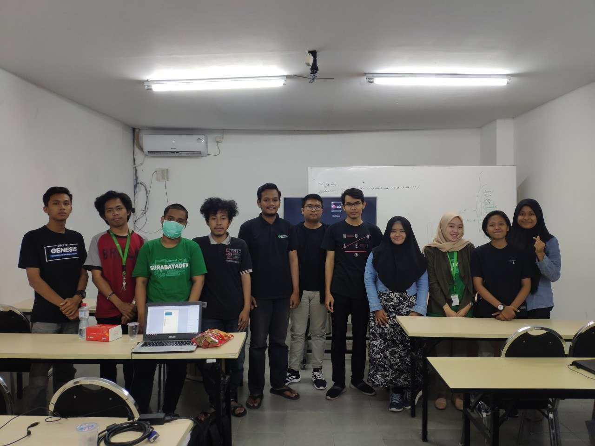
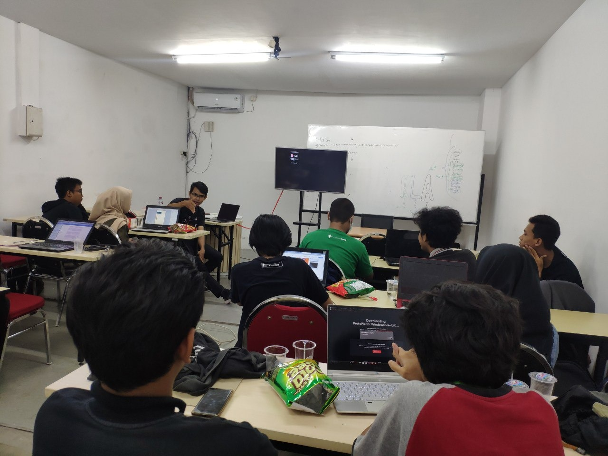
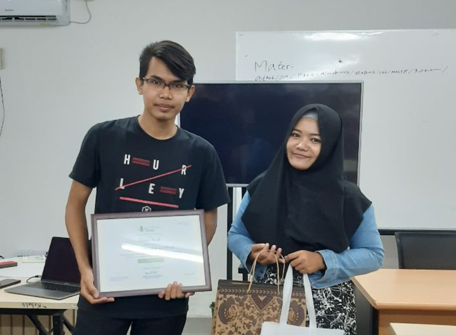

Pada hari Minggu tanggal 26 Januari 2020. Para pengurus [komunitas Surabayadev](http://surabayadev.org) mengadakan kegiatan belajar bersama di **Dilo Surabaya** yang berada di AJBS Surabaya. Pada kegiatan belajar bersama kali ini, pengurus komunitas Surabayadev mengundang pemateri dari [IDN Media](http://idntimes.com).

## Acara khusus yang spesial

Selain memiliki acara publik yang dapat dihadiri oleh berbagai macam kalangan, Surabayadev juga memiliki kegiatan yang hanya boleh dihadiri oleh pengurus [komunitas Surabayadev](http://surabayadev.org) saja. Salah satu kegiatan internal ini adalah belajar bersama. Kegiatan belajar bersama ini diadakan untuk meningkatkan skill yang dimiliki oleh seluruh pengurus [komunitas Surabayadev](http://surabayadev.org).

## Menyelesaikan salah satu masalah komunitas

Salah satu permasalahan yang dihadapi oleh komunitas IT adalah sulitnya mencari pemateri untuk acara yang akan diadakan setiap bulannya. Solusinya adalah pengurus internal yang harus menjadi pemateri jika tidak ada pemateri yang dapat diundang.

Oleh karena itu kegiatan belajar bersama yang diadakan oleh pengurus komunitas Surabayadev ini diharapkan menjadi bekal bagi setiap individu di kepengurusan Surabayadev agar memiliki keberanian naik panggung, alias memiliki keberanian yang cukup untuk mengisi meetup bulanan di komunitas Surabayadev.

## Acara UI UX

Kegiatan belajar bersama kali ini mengusung tema UI UX, pematerinya langsung dari IDN Media loh, namanya mas Afdolash Nur Kaffah, mas afdol saat ini bekerja sebagai UI/UX Designer di media besar tersebut. Seperti nama pematerinya, kegiatan belajar bersama ini memang sangat afdol bila dihadiri oleh seluruh pengurus, karena materinya ciamik. Terimakasih ya mas afdol, semoga hidupmu afdol atas kebaikanmu.

Acara berlangsung dari pukul 13.00 - 17.00, dan materi yang diberikan oleh Afdolash Nur Kaffah adalah :

1. Tahapan menjadi UI/UX designer
2. Pewarnaan pada design
3. Perbedaan UI/UX
4. Adobe XD

## Sesi akhir acara

Seperti yang sebelumnya, sesi akhir dari acara ini ditutup dengan diskusi langsung, setiap individu dapat memberikan pertanyaan kepada mas Afdolash Nur Kaffah, seperti menanyakan perilah cara memperoleh project UI/UX, salary, dll.

Dan setelah itu masuk kepada ritual intinya yang tidak boleh ketinggalan sama sekali, yaitu pembagian merchandise, dan foto-foto. Berikut foto-fotonya:

