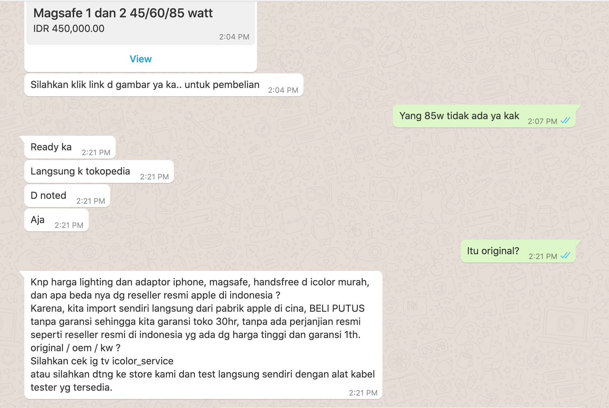
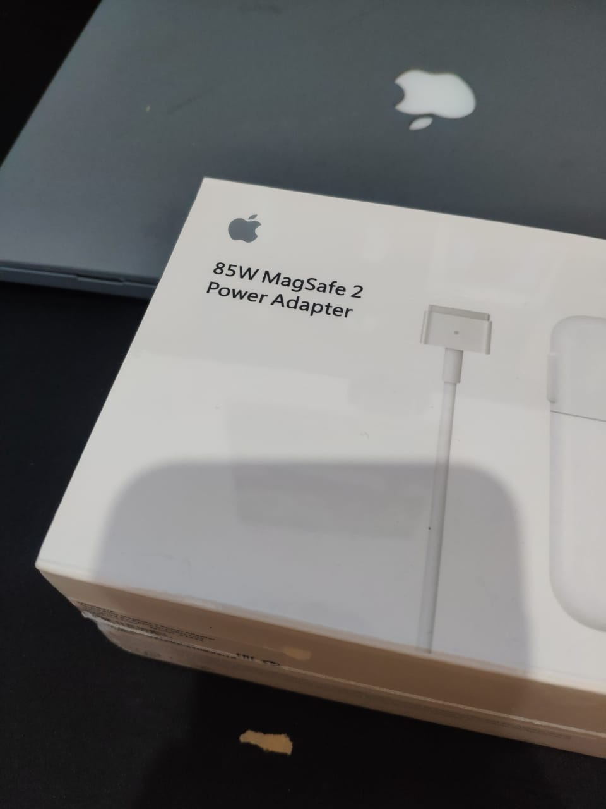
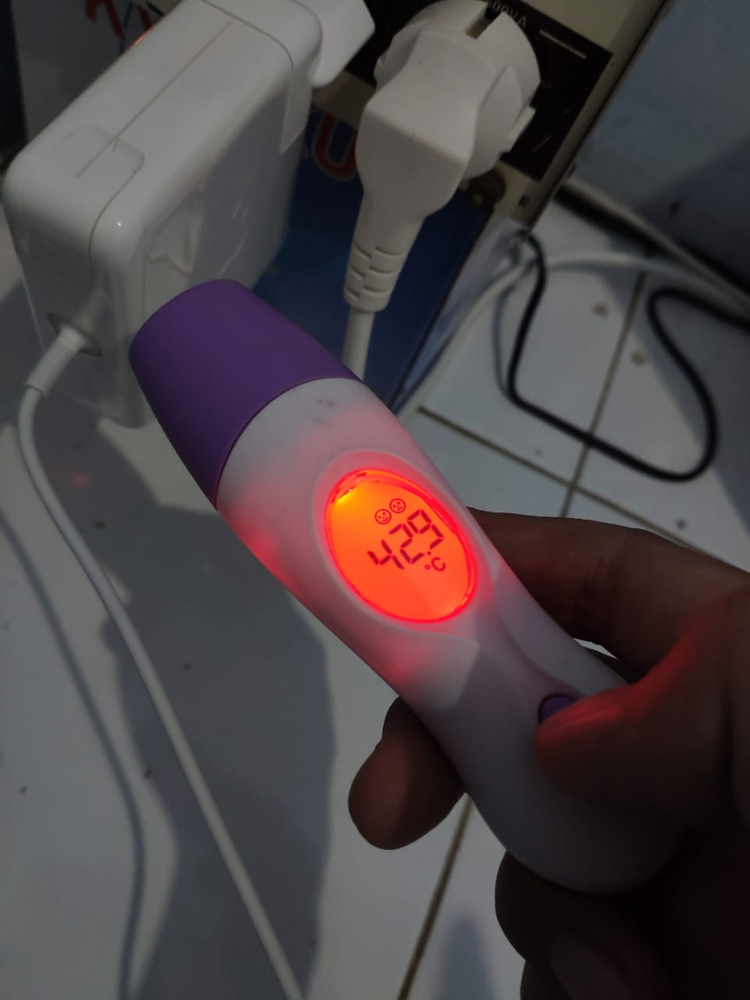
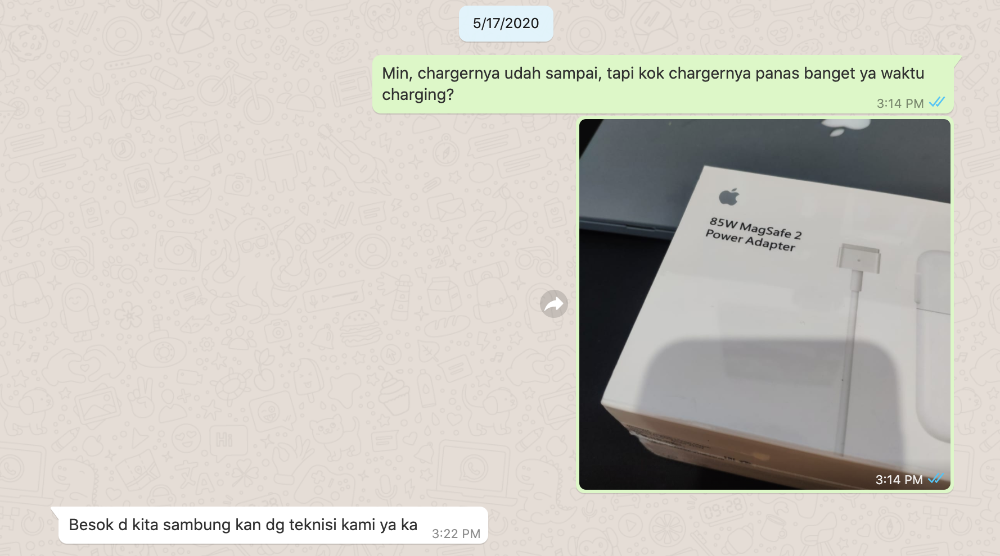
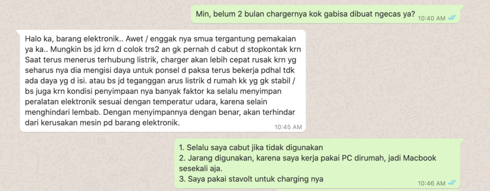
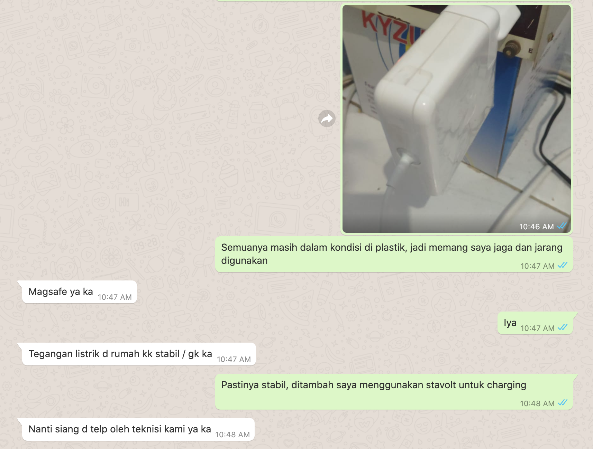
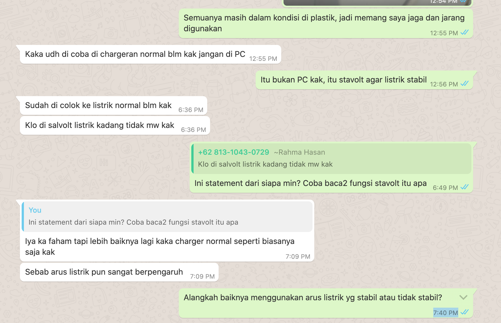
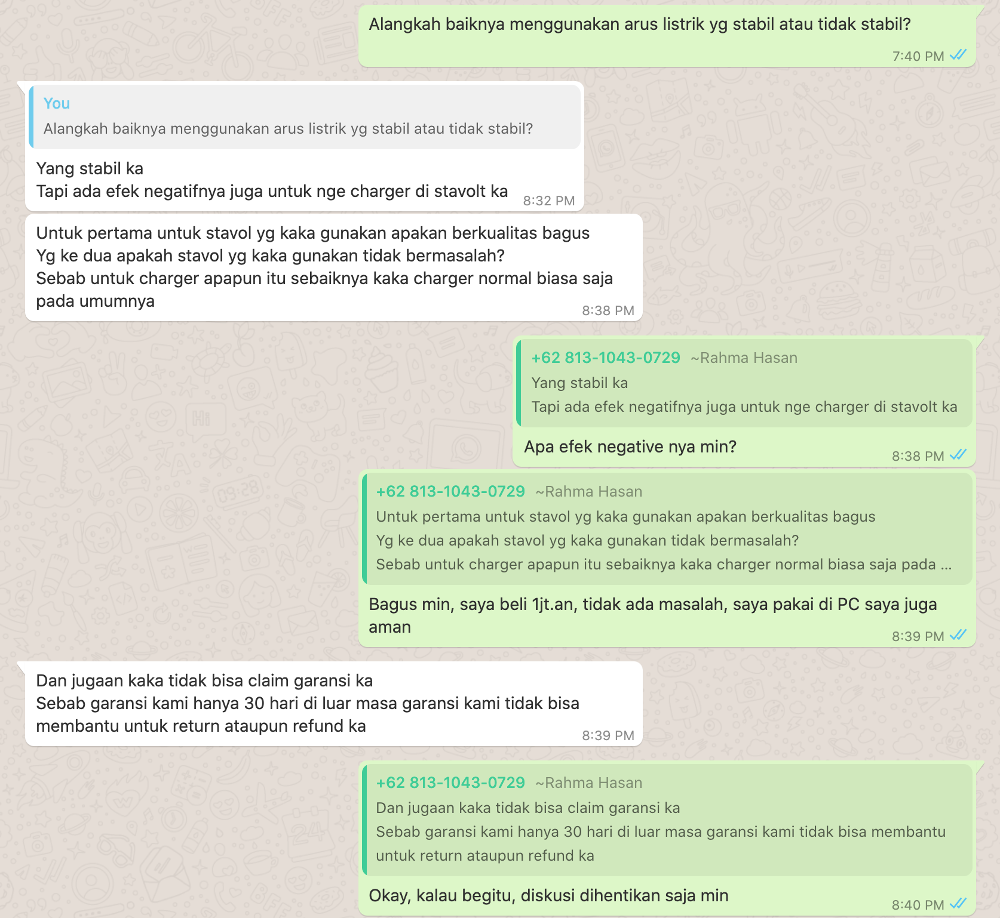

Saya pengguna _Macbook Pro 2015 i7 RAM 16gb_, setelah sekian lama pemakaian, ditahun ini _charger_ Macbook saya mengalami masalah, tepatnya 2 bulan yang lalu.

_Magsafe_ 2 (tipe _Magsafe_ untuk Macbook yang saya miliki) tiba-tiba tidak melakukan charging, tidak ada indikator lampu menyala pada _Magsafe_ yang ada, sudah saya coba lakukan _reset_ SMC, dan lain hal, tetap juga tidak ada daya yang masuk. Dan mungkin sudah saatnya ganti ?.

## Mencari Magsafe 2 di Marketplace

Pencarian saya lakukan di beberapa _marketplace_ di Indonesia, saya melihat beberapa variasi harga dari 350.000 hingga 1.500.000, sebagai seseorang yang hobi mencari barang murah, saya coba lihat dari harga yang enggak terlalu murah.

Saya menemukan beberapa seller di _marketplace_ dengan jaminan Magsafe yang mereka jual original. Dan yang membuat saya tertarik adalah seller dengan nama "iColor", seller tersebut menjual Magsafe2 seharga Rp 450.000 dengan jaminan original. Selain itu alasan saya membuat saya tertarik dengan seller "iColor" ini karena Gibran yang merupakan Putra dari presiden kita saat ini, menjadi salah satu pemiliki "iColor".

## Konfirmasi Ketersediaan & Originalitas Barang

Akhirnya saya coba untuk mengirim pesan kepada iColor melalui WhatsApp untuk menanyakan perihal ketersediaan barang dan juga originalitas barang tersebut. Berikut screenshot chat saya dengan CS mereka:

Magsafe Dikonfirmasi Original

Setelah mendapatkan penjelasan seperti itu, dan beberapa alasan lain seperti:

1. iColor memiliki toko fisik di beberapa kota di Indonesia
2. Salah satu pemilik iColor adalah anak presiden
3. CS iColor responsive menjawab
4. iColor memberikan jaminan **original**
5. Harga yang cukup murah

Saya akhirnya meyakinkan diri untuk membeli Magsafe di iColor, dan langsung checkout di Tokopedia.

## Uji Coba Magsafe Baru Dari iColor

ini adalah foto penampakan saat Magsafe tiba

Magsafe 2 85w. for Macbook Pro 15inch

Setelah saya coba untuk mengisi ulang daya pada macbook saya menggunakan magsafe 2 yang saya dapat dari iColor, semua berjalan normal, tidak ada masalah.

Namun setelah baterai mencapai 100% saya cabut Magsafe tersebut dari Macbook dan juga dari stop kontak. Saya sangat kaget, ternyata Magsafe tersebut sangat panas, 2 kali lebih panas dari Magsafe 2 yang saya miliki sebelumny (bawaan dari apple).

Akhirnya saya coba menggunakan _thermometer_ untuk mengetahui suhu Magsafe tersebut, ternyata _thermometer_ yang saya miliki tidak dapat mendeteksi panasnya, karena thermometer yang saya miliki memiliki batas suhu maksimal 42.9º C.

Setelah saya coba diamkan 10menit, baru saya ukur lagi dan mendapat foto seperti ini

Temperatur pada magsafe mencapai suhu maksimal, setlah magsafe didiamkan sekitar 10menit. Secara logika sebelum 10menit di diamkan, temperatur magsafe lebih dari 42.9º C.

## Konfirmasi Masalah Ke iColor

Saya chat CS iColor, dan dengan baik direspon oleh CS iColor

Besoknya saya mendapat telepon dari teknisi iColor, saya mengkonfirmasi ulang mengenai originalitas barang dan menanyakan perihal Magsafe yang sangat amat panas.

Jawaban teknisinya tetap sama, jika barang yang mereka jual adalah barang original, dan mengenai masalah panasnya mereka mengatakan jika itu adalah hal wajar, dan tidak akan berpengaruh dengan Macbook.

Karena saya berpikir "ada harga ada barang" jadi saya hanya "Yaudah deh, mungkin karena murah" dan saya akhirnya ragu dengan originalitas barang yang dijual oleh iColor, berikut adalah poin kenapa saya ragu:

1. Magsafe sangat panas, 2kali lebih panas dibanding dengan Magsafe original yang didapat saat membeli Macbook
2. Posisi nomor seri berbeda, menurut informasi yang saya dapat posisi serial number pada magsafe yang beredar di tahun 2015 keatas berada dialam connector Magsafenya, sedangkan yang saya dapat serial number masih berada diluar connector magsafe.
3. Beratnya lebih enteng jika dibanding dengan Magsafe bawan dari Apple.

Perlu dicatat, saya tidak menyatakan barang dari iColor bukan original, saya hanya ragu akan originalitas barangnya, silahkan ditanyakan kembali kepada pihak iColor, dan itu menjadi hak pembeli untuk mempercainya atau tidak.

## Magsafe Akhirnya Rusak

Well, setelah 2bulan berselang, saya mendapati magsafe yang saya beli dari iColor tidak dapat digunakan. Tidak ada indikator charging maupun led yang menyala pada Magsafe, sudah saya lakukan reset SMC dan sebagainya.

Saya coba untuk konfirmasi ulang kepihak iColor, berikut screenshot saya dengan CS iColor

Sekedar informasi, saya sehari-hari menggunakan Desktop Komputer, dan jarang menggunakan Macbook. Macbook saya gunakan untuk keperluan compile aplikasi iOS (saya seorang software developer) atau jika ada keperluan pergi keluar seperti cafe, dan sebagainya.

Dan saya selalu menggunakan stavolt untuk melakukan charging, agar daya yang diterima dan dikeluarkan selalu stabil. SIlahkan baca apa fungsi dari stavolt [disini](http://stavolt.co.id/blog/fungsi-jenis-dan-cara-kerja-stavolt-stabilizer/)

Chat lanjutan dengan CS iColor

## Dihubungi Teknisi iColor

Akhirnya saya dihubungi teknisi iColor melalui WhatsApp. Begini percakapan saya dengan teknisi iColor

Intinya tidak ada solusi yang dapat diberikan oleh iColor guys, seolah iColor menyalahkan stavolt yang saya gunakan. Hal ini sebagai pembelajaran untuk diri saya pribadi, agar lebih berhati-hati dalam membeli peripheral untuk Macbook.

## Pandangan Saya Terhadap iColor

iColor menurut saya pelayanannya cukup bagus, karena CS nya sangat responsif, ditambah ada toko fisik dibeberapa kota, dimana kita dapat langsung mendatangi iColor store yang terdekat jika ingin melakukan servis.

Ditambah di instagram iColor banyak banget customernya, jadi servisnya memang bagus menurut saya.

Saya pernah menanyakan untuk jasa pembersihkan macbook, dan iColor memberikan harga yang paling murah, dan dapat ditunggu di iColor store.

Untuk masalah charger Macbook yang saya alami, mungkin saya lagi apes, dan saya rasa harus berpikir 2kali atau tidak lagi untuk membeli charger Macbook disini.

Sekian.
