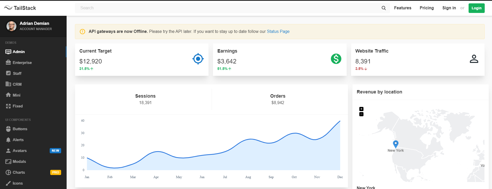
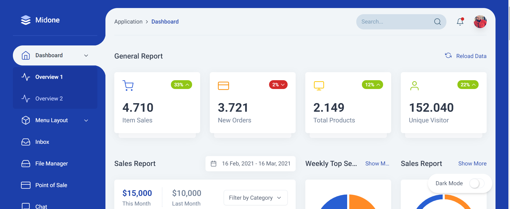
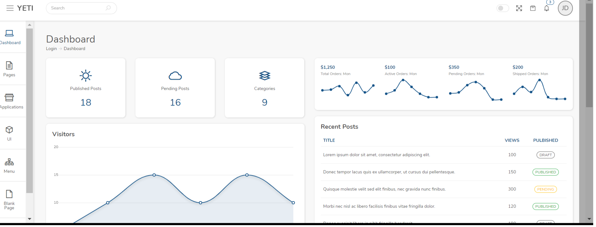
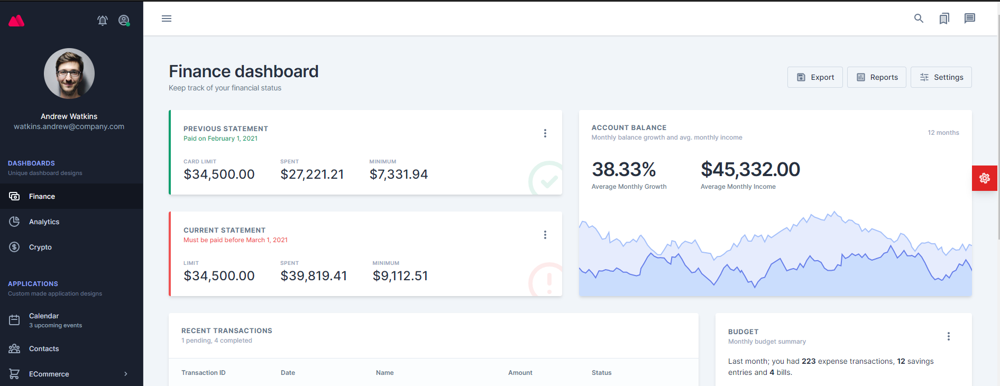
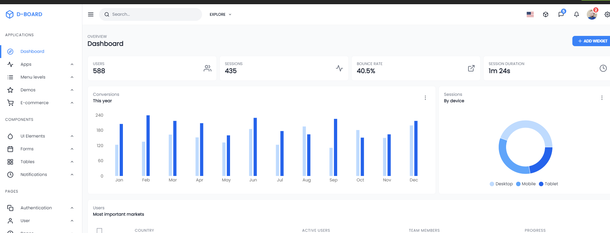
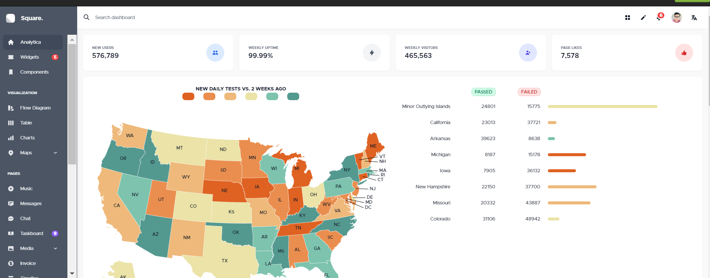
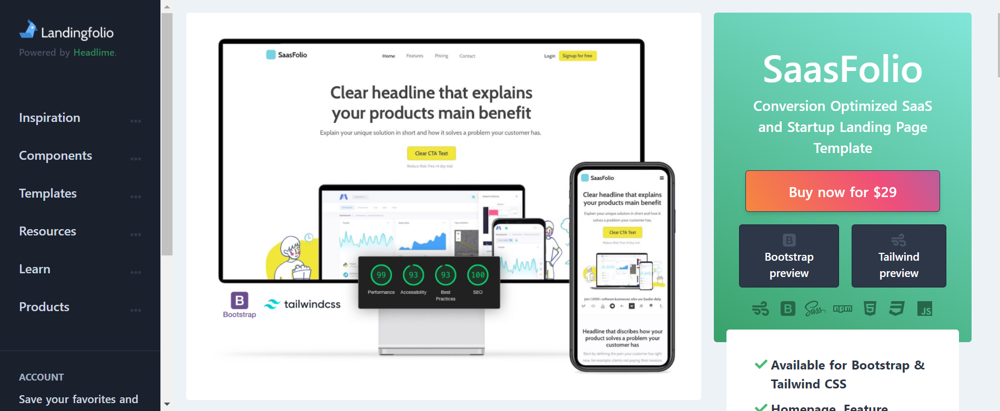
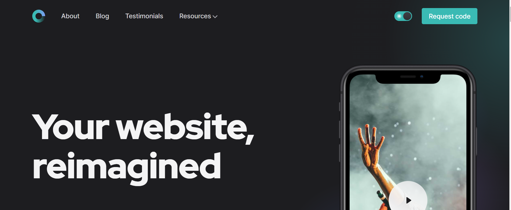
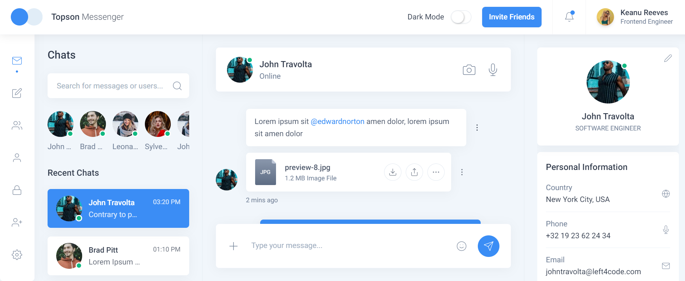

import TailwindComponentHorizontalLists from "~/components/TailwindComponentHorizontalLists.astro";
import GoogleAds from "~/components/Ads.astro";

It's little wonder that CSS frameworks have evolved over time and have taken away most of the discomfort.

A CSS framework that targets numerous screen sizes is a must-have for today's web developers.

Because Tailwind CSS is not a UI kit and doesn't contain default themes or built-in UI components, it differs from other frameworks such as Bootstrap, Foundation, or Bulma.

When it comes to customisation, it's a very strong framework, assuming you don't mind the repetition in your mark-up, because you can create any website you can think of with it.

## Tailwind CSS - What is it and how does it work?

A utility-first CSS framework for quickly creating custom designs, Tailwind CSS is a CSS framework that focuses on utility. In short, Tailwind CSS is a highly adaptable, low-level CSS framework that allows developers all the building blocks they need to build personalized designs without having to worry about bothersome opinionsated styles.

## Using Tailwind CSS has several advantages

In the world of web development, Tailwind CSS is becoming increasingly prominent. More than 2,000 Google searches per month have been made in less than three years since its debut. A few advantages that Tailwind has over other frameworks will be discussed here.

- It has a lot of flexibility.

- Tailwind CSS is an easy-to-use, quick-to-install solution.

- Versatile

- No included JavaScript, You can easily tie it with any JavaScript framework of your choice

Listed here are the greatest Tailwind CSS Admin Templates:

<GoogleAds />

## TailStack TailwindCSS

[TailStack](https://1.envato.market/ZdbXBz) has different designs, layouts, and user interface components and is fully responsive. It's easy to customize TailStack for any application, whether it's for enterprise CRMs or SAAS administrators. It's entirely responsive on all devices and browsers, including mobile devices.

Based on Tailwind CSS 2.x. These UI components come with multiple layout and demo options, as well as SASS files for customizing the look and feel of the components.

<TailwindComponentHorizontalLists />

<GoogleAds />

## Midone TailwindCSS

"[Midone](https://1.envato.market/oeRz0W)" is an admin dashboard template with a fully-responsive web UI component. Constructed to exactly suit a variety of different devices. Some of its distinctive pages and components can assist you in building a quick and easy admin application.

**Features**

- Support with Laravel Mix Compiler
- TailwindCSS 2
- Fully Responsive Layout
- SASS-Powered
- Modular JS & CSS Code

## Yeti Admin Template – TailwindCSS

The [Yeti Admin](https://1.envato.market/JrbJ4v) theme was created with simplicity in mind, and it's no different with all of this theme. To meet any Admin and Web App demands, all pages and apps have been carefully designed. In Vanilla JS, all JavaScript functions are well-written. Dependencies are minimized to the maximum extent practicable. CSS framework Tailwind CSS is utilized in its development (v2.0).

**Features**

- Dark Mode is a mode in which the
- Modern Design using Modular Structures
- Multiple Layouts
- Custom UI Components
- Custom Applications

## Treo TailwindCSS

[Treo](https://1.envato.market/WDX4Re) has multiple layouts, including custom-made Application and Page layouts and UI elements and UX best practices. In addition, Treo's multi-layout configuration allows you to use different templates without making any major changes to the template's structure to do so. Treo's flexibility is further enhanced with the ability to set different routes, which allows for any page design inside the same codebase.

**Features**

- Modularity is a key feature of the design.
- You can choose from a variety of layouts.
- With this feature, it is possible to create a separate layout for every route.
- Application and page designs that are already constructed and ready to use.
- Prepared content layouts are available.

<TailwindComponentHorizontalLists />

<GoogleAds />

## D-Board Theme

D-Board is on top of Next.js, Redux, and Tailwind CSS, D-board is a responsive dashboard template with a high level of sophistication. Additionally, it comes with more than a hundred elements (for each layout) and various reusable widgets to assist you in building your next Tailwind project or online application.

**Features**

- Next.js
- Server Side Rendering Ready.
- Redux and React hooks are now available.
- Both variations are available in both light and dark colors
- TailwindCSS 2.0

<TailwindComponentHorizontalLists />

## Square Admin – TailwindCSS

A React admin/dashboard template, [Square Admin](https://1.envato.market/b3bG2M) has a unique design. It supports light and dark color schemes, as well as SSR, right out of the box. It's designed using Tailwind's CSS library and can be tweaked to meet your needs.

**Features**

- Layouts in LTR and RTL
- UI components that can be reused
- Palettes of light and dark
- Completely Responsive (Mobile, Tablet, Desktop)

<TailwindComponentHorizontalLists />

<GoogleAds />

## Concavo

[Concavo](https://1.envato.market/Eab9JD) Theme is simple. React, Redux, and Next.js are used to create this complex admin template using SASS. It includes more than 100 components in every layout, as well as widgets and custom-made reusable components to help you get started with your next React project or application quickly.

**Features**

- Including four layouts, 100 pages/components, and
- Two dashboard examples
- Reloading of the code in real-time and rendering in a universal manner
- Splitting code automatically

## SaasFolio – Tailwind CSS Admin Template

[SassFolio](https://www.landingfolio.com/templates/products/saasfolio). As the name suggests, this landing page design focuses on conversion. Because it focuses on great sales copy and content hierarchy, it stands out from other similar resources on the market.

**Features**

- It has 95+ Template Detailed documentation for Google Page Speed
- Complete W3C Valid HTML5 File
- Home Page
- Feature and Pricing Pages
- Login Page
- Signup Page

<TailwindComponentHorizontalLists />

## Open PRO - TailwindCSS

If you're looking for an eye-catching landing page template, [Open PRO](https://cruip.com/) is it. Featuring various pages and components, this resource is a perfect solution for various SaaS and app-based web applications and services.

**Features**

- React, and Vue are among the supported languages.
- Pages, sections, and components in multiple forms
- High-quality template for your website
- Fully Responsive

## Topson – Chat Messenger App HTML Template

[Topson](https://1.envato.market/6bWAom) Template for the messenger dashboard that is fully responsive. Designed with care to accommodate a variety of devices. As well as individual sites and components, it makes it easy to create Chat Messenger Apps.

**Features**

- A Fully Responsive Layout
- Modular JS and CSS Code
- TailwindCSS 2
- Laravel Mix with Webpack Compiler
- Helper and Utility Classes

<GoogleAds />

## Conclusion

This is a great framework since it allows you to design web apps the way you want them to be built without any restrictions. Thanks for reading and good luck with your new project in Tailwind CSS.
