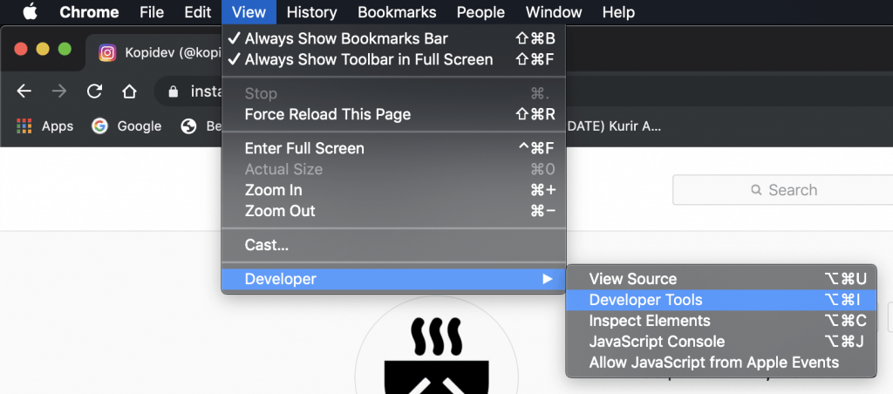
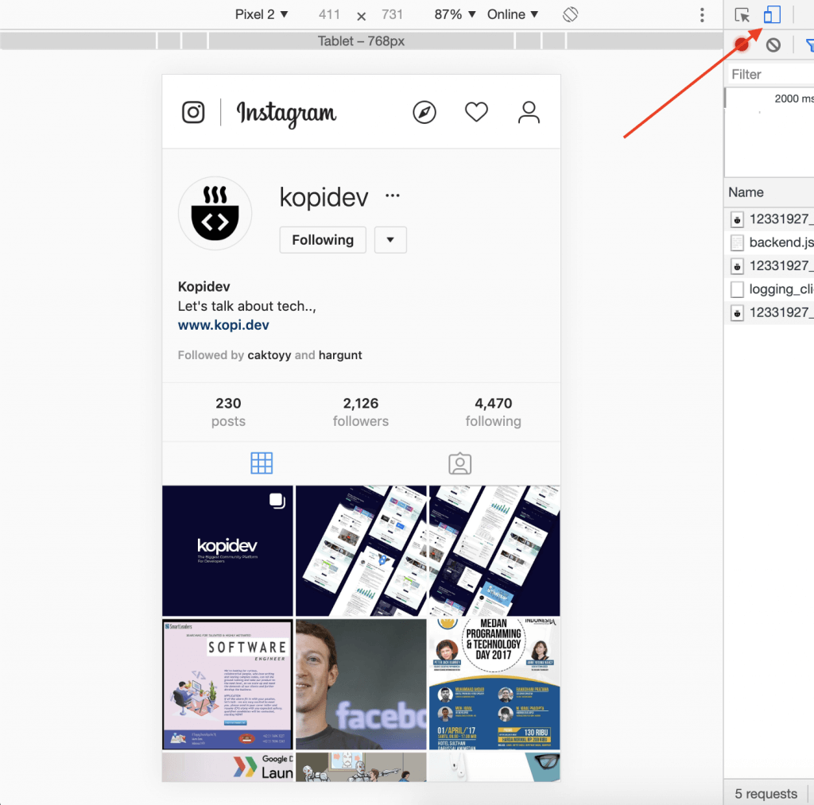
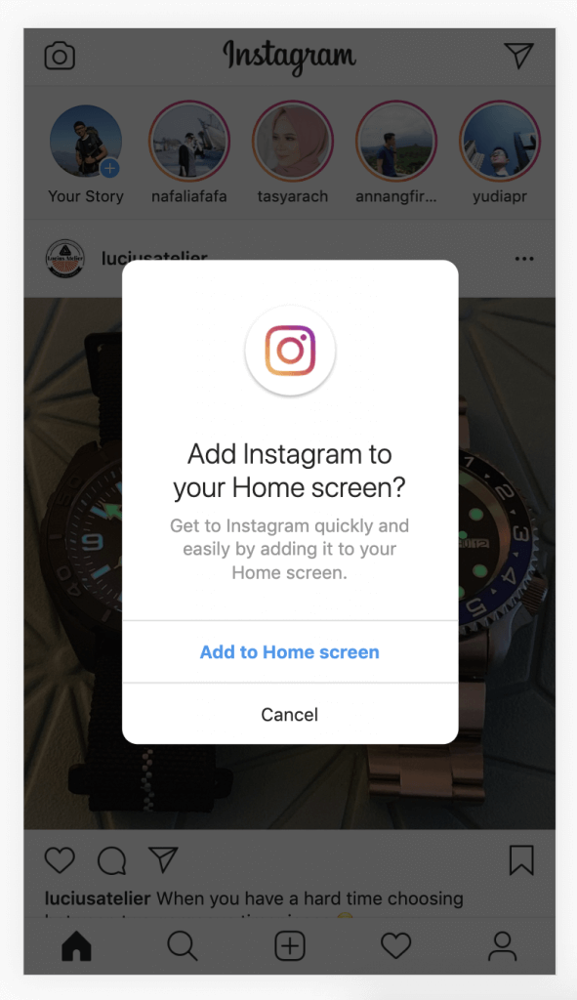
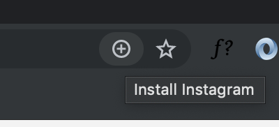
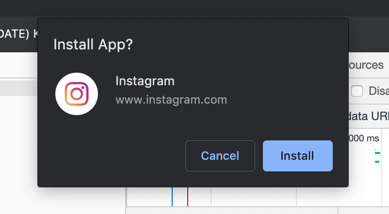
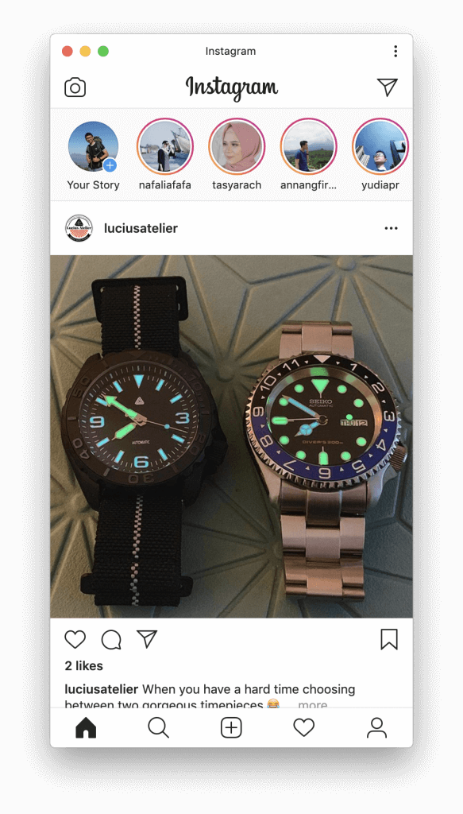

Saya masih inget beberapa tahun kebelakang, ingin rasanya buka Instagram di PC, namun sulit banget. Yang masih saya ingat adalah harus install BlueStack, Genymotion, dll. Semua itu serba repot.

Berkat teknologi web yang semakin canggih, mungkin kita pernah atau bahkan sering mendengar kata **PWA** atau singkatan dari **Progressive Web Apps**, singkat cerita teknologi Progressive Web Apps saat ini memungkinkan para developer Website untuk membawa experience yang ada di mobile apps kedalam sebuah web app. Dan salah satu keuntungan dari **Progressive Web Apps** sendiri adalah _Installable_.

Itu berarti memungkin pengguna untuk “menyimpan” Web App kedalam Home Screen device atau Komputer tanpa perlu repot-repot menggunakan App Store dan men-download dari sana. Dan saat ini Instagram sudah menerapkan hal tersebut.

## Cara menggunakan Instagram di Komputer

**Pertama** kita buka [Instagram.com](http://instagram.com) di Browser, pada tutorial ini, mimin menggunakan Chrome Browser versi 76

**Kedua** kita buka developer tools, Gunakan [pintasan keyboard](https://developers.google.com/web/tools/chrome-devtools/inspect-styles/shortcuts?hl=id) Ctrl+Shift+I (Windows) atau Cmd+Opt+I (Mac)

**Ketiga** kalian harus mengaktifkan **Toogle Device**

**Keempat** kalian harus refresh browser kalian, dan tampilan instagram akan menjadi seperti dibawah ini, dan akan muncul sebuah popup dengan permintaan untuk menambahkan Instagram ke Home screen kalian.

Jika popup tersebut tidak muncul, pada address bar browser kalian dapat menekan tombol plus diatas. Setelah itu akan muncul sebuah request dari Chrome untuk melakukan install app, kalian konfirmasi dengen menekan tombol **Install** seperti dibawah ini:

Jika seluruh proses diatas berhasil, selamat Instagram dapat di akses melalui PC komputer kalian.

