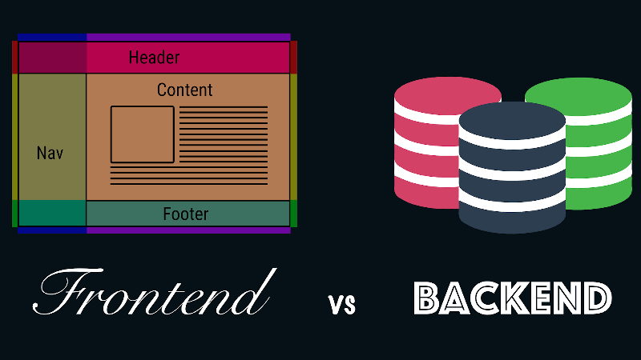

## Apa Itu Front End Developer?

_Front End Developer_ adalah salah satu dari sekian banyak bidang pekerjaan yang ada di dalam dunia pemrograman _Website & Mobile_. Pada suatu proses pembuatan website atau aplikasi, umumnya terdapat 3 komposisi utama yang sangat penting agar website atau aplikasi dapat dinikmati secara sempurna. 3 komposisi tersebut adalah [Front End Developer](https://www.google.com/search?q=frontend+developer), _Backend Developer_, dan _Web Designer_ atau _UI/UX Designer_.

3 komposisi utama ini harus saling bekerja sama dengan baik agar tercipta sebuah website atau aplikasi yang indah yang dapat memanjakan penggunanya.

### Apa tugas seorang Front-end Developer?

Seorang _Front End Developer_ bertugas untuk menerapkan _interface_ dan _experience_ yang telah diberikan oleh seorang desainer _Website_ atau _UI/UX Designer_. Setelah tugas tersebut selesai, _Front End Developer_ masih memiliki tugas lain (**menurut saya ini hanyalah tugas opsi**), yaitu menghubungkan atau melakukan _intregasi_ website atau aplikasi yang telah dibuat dengan data yang telah disediakan oleh _Backend Developer_.

## Apa Perbedaan Antara Front End & Back End Developer?

_Front end developer_ dan _Backend developer_ dapat dibedakan dari lingkup kerja & tugasnya, serta bahasa yang digunakan.

Dari segi bahasa yang digunakan, seorang _Front end Developer_ umumnya menggunakan HTML, CSS, dan JavaScript, sedangkan seorang _Backend Developer_ umumnya menggunakan Golang, PHP, Python, Ruby dan lain sebagainya.

Untuk memahami lebih lanjut tentang perbedaan **Front end dan Back end**, penulis ingin bertanya kepada pembaca.

Setiap harinya kita pasti membuka sebuah website kan? Seperti facebook, google, twitter, situs berita, dan lain sebagainya. Saya rasa jawabannya adalah **"YA PASTI"**.

Yang kita lihat pada layar, serta interaksi yang kita lakukan pada website tersebut, seperti klik tombol, membuka menu, menggeser sebuah gambar, dan lain sebagainya, hal tersebut merupakan lingkup kerja yang dilakukan oleh seorang _Frontend Developer_. Sedangkan seorang _Backend Developer_ bekerja dibalik itu semua dengan cara menyajikan data yang dibutuhkan oleh _Front end Developer_ untuk ditampilkan di layar.

## Relasi Antara Front end Developer dan Backend Developer

Kita bayangkan ada sebuah website sederhana berisi halaman login. Pada halaman login terdapat 2 teks input, yaitu teks input untuk e-mail dan teks input untuk password.

_Front end Developer_ memiliki kewajiban untuk **merekam** _value_ e-mail dan password yang diberikan/di inputkan oleh user.

Saat user selesai mengisi inputan e-mail dan password, user menekan tombol "submit", saat ada aksi tekan tombol "submit" _Front end Developer_ bertugas untuk mengirim sebuah request(permintaan) kepada _Backend Developer_, request yang dikirim oleh *Front end* berisi e-mail, dan password yang telah direkam sebelumnya.

_Backend Developer_ kemudian menerima data dari request yang dikirim oleh _Front end Developer_, data yang diterima oleh _Backend Developer_ end berisi e-mail, dan password.

_Backend Developer_ kemudian bertugas untuk mencocokkan data yang diterima dari request tadi ke dalam database.

Pada tahapan ini, ada atau tidak adanya data yang cocok, antara data yang ada di dalam database dengan data yang diterima, _Backend developer_ wajib memberikan informasi (response) tersebut kepada _Front end Developer_.

Sehingga front end dapat menjelaskan kepada user tentang hasil(response) dari aksi login yang dilakukan oleh user tersebut.

## Perbedaan Lingkup Kerja Front end Developer dan Backend Developer

<table style={{ height: "295px" }} width="498">
  <tbody>
    <tr>
      <td>
        <strong>Front end</strong>
      </td>
      <td>
        <strong>Backend</strong>
      </td>
    </tr>
    <tr>
      <td>HTML, CSS, JavaScript, dll</td>
      <td>Python, Golang, PHP, Ruby, dll.</td>
    </tr>
    <tr>
      <td>Aksesibilitas</td>
      <td>Arsitektur Server</td>
    </tr>
    <tr>
      <td>Cross Browser Testing</td>
      <td>Security</td>
    </tr>
    <tr>
      <td>SEO implementation</td>
      <td>Application Programmable Interface (API)A</td>
    </tr>
  </tbody>
</table>

## Tahap-tahap untuk menjadi  seorang Front end Developer?

Apabila kita telaah dunia front end development pada 5 tahun terakhir, mungkin kita akan sering mendengar terminologi yang belum pernah kita dengar pada artikel, dan video seperti _ES6, jQuery, React, Redux, Webpack, Babel, TDD, JEST, Git, async, OOP, functional-style, npm, Node.js, Yarn, SQL, NoSQL, Graph databases, MongoDB, Angular._

Jika sekitar tahun 2010 kita hanya butuh HTML, CSS, JavaScript atau mungkin jQuery dalam membuat website, pata tahun 2020 sekarang ini sudah sangat amat jauh berbeda, bahkan ada sebagian orang yang menganggap jika jQuery sudah masuk ke zona "outdated" alias zona lawas yang sudah harus ditinggalkan.

Front end development memiliki pertumbuhan yang sangat cepat, sehingga standarisasi seorang _Front end developer_ juga ikut semakin rumit, dan muncul terminologi diatas.

Berdasarkan research dan pengalaman saya di dunia _Front end Development,_ saya membagi hal yang harus dilalui seorang Front end Developer kedalam beberapa tahap, berikut adalah tahapannya:

<table>
  <tbody>
    <tr>
      <td width="100px">
        <strong>Kelas</strong>
      </td>
      <td>
        <strong>Kualifikasi Yang Harus Dilalui</strong>
      </td>
    </tr>
    <tr>
      <td>
        <strong>Kelas 1</strong>
      </td>
      <td>HTML</td>
    </tr>
    <tr>
      <td></td>
      <td>CSS</td>
    </tr>
    <tr>
      <td></td>
      <td>JavaScript</td>
    </tr>
    <tr>
      <td></td>
      <td>jQuery Framework</td>
    </tr>
    <tr>
      <td></td>
      <td>Bootstrap Framework</td>
    </tr>
    <tr>
      <td></td>
      <td>Penggunaan GIT</td>
    </tr>
    <tr>
      <td></td>
      <td>Instalasi Web pada Hosting</td>
    </tr>
    <tr>
      <td></td>
      <td>Konfigurasi Domain, SSL</td>
    </tr>
    <tr>
      <td>
        <strong>Kelas 2</strong>
      </td>
      <td>
        Package Manager (Yarn, NPM) <strong>*</strong>
      </td>
    </tr>
    <tr>
      <td></td>
      <td>
        Task runner (NPM Script, Gulp, dll) <strong>*</strong>
      </td>
    </tr>
    <tr>
      <td></td>
      <td>
        CSS Arsitektur (BEM, OOCS, SMACSS) <strong>*</strong>
      </td>
    </tr>
    <tr>
      <td></td>
      <td>
        CSS Preprocessor (SASS, PostCSS, LESS, dll) <strong>*</strong>
      </td>
    </tr>
    <tr>
      <td></td>
      <td>
        CSS Framework (Material UI, Reactstrap, Tailwind) <strong>*</strong>
      </td>
    </tr>
    <tr>
      <td></td>
      <td>
        Modern CSS (Styled-components, CSS Module) <strong>*</strong>
      </td>
    </tr>
    <tr>
      <td></td>
      <td>Linter dan Formatter (Prettier, ESlint)</td>
    </tr>
    <tr>
      <td></td>
      <td>
        Module Bundler (Webpack, Parcel, Rollup) <strong>*</strong>
      </td>
    </tr>
    <tr>
      <td></td>
      <td>
        Menggunakan Framework (React, VueJS, Angular, Svelte) <strong>*</strong>
      </td>
    </tr>
    <tr>
      <td></td>
      <td>
        Memahami state management (Redux, Mobx, Unistore) <strong>*</strong>
      </td>
    </tr>
    <tr>
      <td>
        <strong>Kelas 3</strong>
      </td>
      <td>Memahami Testing (Unit test, Integration Test, Functional Test)</td>
    </tr>
    <tr>
      <td></td>
      <td>
        Menggunakan Testing Framework (Jest, Cypress, Enzyme, dll)
        <strong>*</strong>
      </td>
    </tr>
    <tr>
      <td></td>
      <td>
        Type checker (Typescript, Flow) <strong>*</strong>
      </td>
    </tr>
    <tr>
      <td></td>
      <td>Progressive Web Apps</td>
    </tr>
    <tr>
      <td></td>
      <td>Server Side Rendering</td>
    </tr>
    <tr>
      <td></td>
      <td>GraphQL</td>
    </tr>
    <tr>
      <td></td>
      <td>Static Site Generator</td>
    </tr>
    <tr>
      <td></td>
      <td>
        Mobile Apps (Javascript Framework) <strong>*</strong>
      </td>
    </tr>
    <tr>
      <td></td>
      <td>
        Desktop Application (Electron, Proton, dll) <strong>*</strong>
      </td>
    </tr>
    <tr>
      <td></td>
      <td>Web Assembly</td>
    </tr>
    <tr>
      <td></td>
      <td>Dll.</td>
    </tr>
  </tbody>
</table>

_**\*Dapat memilih salah-satu dari sekian opsi yang ada, namun baik apabila kita dapat memahami opsi lainnya**_

## Berapa gaji seorang Front-End Developer di Indonesia?

Dengan banyaknya rintangan yang harus dilalui untuk menjadi seorang front end developer yang keren, mungkin muncul sebuah pertanyaan Berapa sih gaji seorang Front end Developer? Emang sesuai dengan yang sudah dilalui?.

Saya mendapatkan data dari beberapa situs seperti techinasia.com, careerexplorer.com, dll. Dan setelah saya rangkum dari beberapa situs tersebut saya mendapat nilai rata-rata.

Di Indonesia gaji seorang front end developer berkisar pada angka:

<table>
  <tbody>
    <tr>
      <td width="70px">
        <strong>Level</strong>
      </td>
      <td>
        <strong>Gaji</strong>
      </td>
    </tr>
    <tr>
      <td>Junior</td>
      <td>Rp 5.000.000 - Rp 7.500.00</td>
    </tr>
    <tr>
      <td>Mid</td>
      <td>Rp. 7.500.000 - 15.000.000</td>
    </tr>
    <tr>
      <td>Senior</td>
      <td>Lebih dari Rp. 15.000.000</td>
    </tr>
  </tbody>
</table>

## Kesimpulan

Lebih dari 20 tahapan yang harus dilalui untuk menjadi seorang Front end Developer, itu angka yang cukup banyak, dan butuh waktu yang tidak sedikit.

Saya sangat menyadari jika hal ini dapat membuat seseorang yang ingin mulai belajar akan berjalan mundur perlahan karena sudah takut melihat list yang sebanyak itu.

Oleh karena itu pada series ini kita akan sama-sama belajar untuk menjadi seorang Front end Developer dengan menggunakan sebuah project atau istilahnya real world example, sehingga dapat lebih mudah memahami tentang maksud dan tujuan dari sebuah tahapan yang harus dilalui seorang front end developer.

Terminologi yang banyak disebutkan di atas hanyalah sebuah tools, framework, metode, dan lain sebagainya yang _front end developer_ butuhkan di tahun 2018 kedepan.

Saran saya jangan terlalu dipikirkan, relax saja, dan jangan takut, karena saya yakin semua akan paham jika waktunya sudah tepat.

Oleh karena itu, saya mencoba menulis artikel ini untuk membimbing teman-teman agar menjadi seorang _Front end Developer_ yang ciamik dan hebat.

Jangan lupa untuk selalu buka situs ini, karena series ini akan selalu di perbaharui. Jika ada masukan atau pertanyaan, teman-teman dapat bertanya melalui kolom komentar. Saya akan berusaha menjawab sebaik mungkin.
