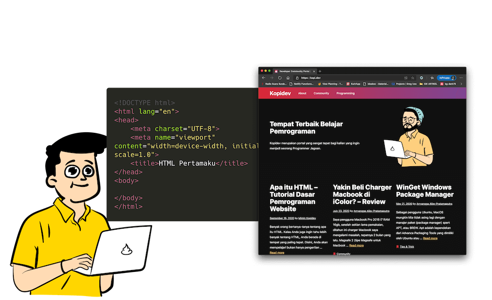
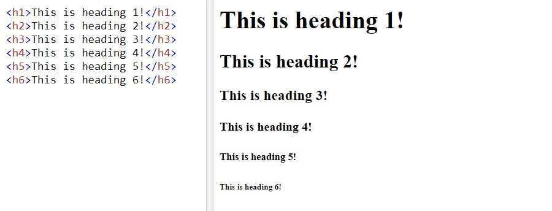
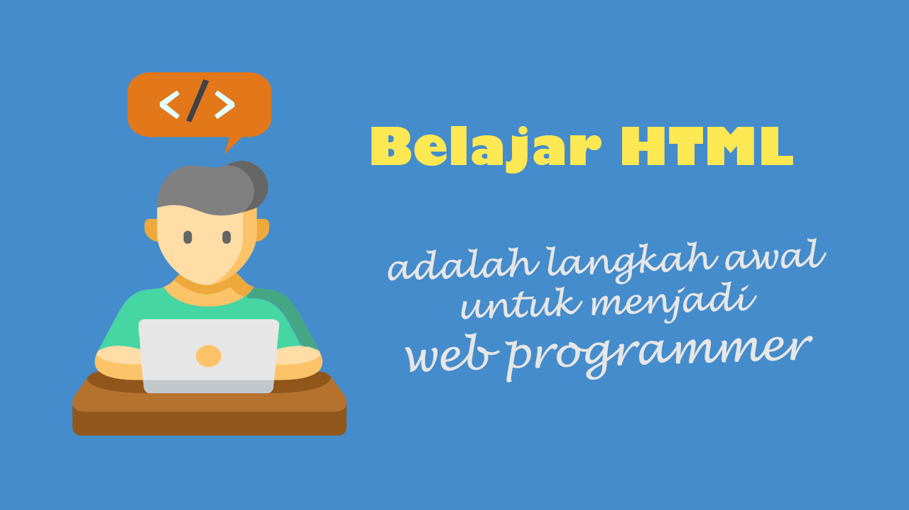

Banyak orang bertanya-tanya tentang **apa itu HTML**. Kalau Anda juga ingin tahu lebih banyak tentang HTML, Anda berada di tempat yang paling tepat.

Disini, Anda akan mempelajari bukan hanya pengertian dari HTML, tetapi juga bagaimana cara kerjanya dan berbagai hal lain mengenai HTML.

Sudah siap untuk mempelajari HTML lebih dalam? Mari kita mulai sekarang.

## Apa itu HTML?



HTML sendiri merupakan sebuah singkatan dari **_HyperText Markup Language_**.

HTML merupakan salah satu bahasa markup/markah yang ada di dunia pemrograman _web development_.

HTML ini diciptakan untuk membantu Anda dalam membangun sebuah situs web. HTML memungkinkan kita untuk membuat dan menyusun sebuah paragraf, judul, tautan, gambar, audio, video, serta komponen lain untuk website.

HTML dapat dipelajari dengan mudah karena pengetahuan dasar tentang HTML yang sangat amat banyak di Internet, sehingga Anda akan sangat mudah untuk mempelajarinya.

Setiap tahunnya HTML mengalami revisi serta evolusi secara terus-menerus agar dapat memenuhi persyaratan serta permintaan para pengguna jaringan internet yang juga terus berkembang.

Terdapat sebuah organisasi bernama **W3C** yang mengemban tugas khusus untuk merancang serta memelihara bahasa markup/markah tersebut. Pendiri W3C adalah Tim Berners-Lee


### Hypertext

_HyperText_ adalah sebuah metode yang dapat Anda gunakan untuk berpindah-pindah ketika berada di situs web. Hal itu dilakukan dengan cara mengklik sebuah _hyperlink_.

> Ini adalah contoh Hyperlink --> [klik disini](https://kopi.dev)

_Hyperlink_ merupakan sebuah teks khusus yang berisi sebuah tautan, sehingga Anda akan dibawa ke halaman sesuai dengan tautan yang dituju. Hyper berarti bahwa teks dalam website tersebut tidak bersifat linear. Ini berarti Anda bisa pergi kemanapun di Internet dengan mengklik.

### Markup Language

_Markup Language_/ Bahasa Markah adalah sebuah cara untuk memberikan anotasi pada sebuah dokumen. Dengan adanya sebuah Markup, kita dapat menentukan bagaimana sesuatu harus ditampilkan atau menentukan arti dan tujuan dari sebuah kalimat atau kata.

Oleh karenanya kita dapat menentukan arti pada sebuah dokumen, misalnya kita dapat menentukan mana kalimat atau kata yang harus ditandai dengan huruf tebal, miring, berwarna dan lain sebagainya.

Beberapa contoh bahasa markup selain HTML:

- HTML – Hypertext Markup Language
- Markdown
- KML – Keyhole Markup Language
- MathML – Mathematical Markup Language
- SGML – Standard Generalized Markup Language
- XHTML – eXtensible Hypertext Markup Language
- XML – eXtensible Markup Language

## Bagaimana Cara Kerja HTML?

Jadi, Anda telah memahami **apa itu HTML**. Tapi, tahukah Anda bagaimana HTML bekerja? Berikut cara kerja HTML.

- HTML terdiri dari sebuah rangkaian kode pendek. Kode-kode pendek tersebut kemudian diketik ke dalam sebuah file teks. Teks yang telah diketik selanjutnya disimpan dengan ekstensi .html sehingga disebut sebagai file HTML.
- Teks tersebut dapat dilihat melalui berbagai browser seperti Chrome, Edge, dll, Browser-browser tersebut membaca file yang tersimpan kemudian menerjemahkan teksnya dalam bentuk yang bisa Anda lihat sesuai dengan keinginan pembuat website.

Mudah bukan? Jika Anda ingin menulis HTML Anda sendiri, Anda perlu menggunakan tag HTML dengan benar dalam menciptakan tampilan yang tepat. Untuk menulis file HTML, Anda dapat menggunakan segala jenis teks editor yang ada dari yang bersifat gratis hingga berbayar.

## Fungsi Tags Dalam HTML

Apa sih peranan tags dalam HTML? Pertanyaan ini seringkali dilontarkan oleh mereka yang terutama masih baru memulai pemrograman website.



Tags berfungsi untuk memisahkan teks normal dari kode atau sintaks HTML. HTML menggunakan tag untuk sintaksnya. Tag dibuat dengan karakter khusus:

```html
<sebuahTag> </sebuahTag> // penutup
```

Setiap TAG HTML selalu diawali dengan `<namaTag>`, dan diakhiri dengan `</namaTag>`

Dengan adanya tags html, sangat memungkin untuk menampilkan hal-hal yang menarik seperti menampilkan tabel dan gambar, video, audio serta hal lain.

Setiap tags memiliki tujuan dan maksud yang berbeda. Tags yang berbeda akan menjalankan fungsi yang berbeda pula.

Ketika Anda melihat sebuah halaman website melalui browser, tags html tidak akan ditampilkan oleh Browser, namun yang Browser tampilkan adalah hasil kompilasi tags HTML, contohnya seperti ini

```
<b>Kalimat ini akan menjadi tebal</b>, dan yang ini tidak.
```

Potongan sintaks html diatas akan menjadi seperti ini

```html
**Kalimat ini akan menjadi tebal**, dan yang ini tidak

Dengan menambahkan <b> di awal dan akhir dari teks, Anda akan mendapatkan teks yang menjadi tebal ketika dilihat melalui browser yang biasa. Contoh tags yang lain adalah:

- `<head>` yang menyatakan bagian kepala pada dokumen HTML
- `<body>` menandakan isi dari sebuah dokumen HTML
- `<title>` merupakan tanda judul HTML yang nantinya akan ditampilkan tepat pada bagian judul di jendela browser
- `<br>` tag yang menandakan pergantian baris
- `<p>` digunakan untuk membuat paragraf baru
- `<h1>` adalah header web tag yang digunakan untuk judul situs web
- `<h2>` atau header 2 merupakan tag untuk membuat subjudul dalam situs web
- `<i>` merupakan italic tag yang fungsinya adalah membuat teks yang tercetak miring dihalaman browser.
```

Dan masih banyak lagi tag dalam HTML yang fungsinya bermacam-macam dan bisa digunakan untuk menciptakan tampilan situs web yang menarik.

## Waktu Yang Dibutuhkan Untuk Membuat HTML



Mempelajari HTML tidak memerlukan waktu lama. Untuk bisa mengetahui HTML, Anda hanya perlu meluangkan beberapa hari agar bisa berkonsentrasi membaca serta mempelajari kode HTML yang cocok dengan keinginan Anda. Untuk mempelajari dasar-dasar HTML saja, waktu yang diperlukan hanya sekitar satu jam. Segera setelah Anda mengetahui tags, Anda bisa mulai membuat halaman HTML.

Lain halnya jika Anda ingin menggunakan HTML yang telah Anda buat serta merancang sebuah situs web yang menarik. Untuk membuat sebuah desain situs web yang menarik, diperlukan bakat serta keahlian serta beberapa hal penting lain seperti:

- Mempelajari teknik serta penggunaan tag yang benar guna meningkatkan pekerjaan membuat situs web.
- Memiliki pemahaman yang baik mengenai desain dan mengenai target pembaca yang ingin Anda jangkau agar bisa meningkatkan peluang kesuksesan situs web Anda.
- Memperoleh keterampilan dalam bidang desain grafis, tipografi, serta pemrograman komputer sehingga Anda bisa menjalankan situs web yang mengesankan dan menarik.
- Mempelajari Teknik promosi juga diperlukan agar bisa beradaptasi dalam membuat tulisan yang ditujukan pada audiens yang dituju.

Dengan memperoleh bekal seperti dalam daftar di atas, Anda akan siap untuk bekerja dengan komputer secara efisien. Untuk membuat file HTML kita tidak perlu untuk online sepanjang waktu. Anda tentu bisa mengkodekan situs web Anda seluruhnya secara offline, untuk kemudian disimpan di komputer yang Anda miliki. Selanjutnya, Anda bisa mentransfer seluruh file tersebut ke penyedia layanan hosting.

## Perkembangan Terbaru HTML

Di masa lalu, kemampuan HTML dapat dikatakan terbatas karena ada beberapa hal yang tidak bisa dilakukan oleh HTML.

Tapi seiring dengan berkembang pesatnya tren pembuatan situs web, bahasa pendukung lain telah diciptakan sehingga hal-hal baru bisa diwujudkan. Selain itu, HTML sendiri dimodifikasi setiap beberapa tahun sekali untuk memberi jalan bagi kemajuan HTML.

Sebagai contoh dengan adanya Cascading Style Sheets (CSS) yang dapat Anda gunakan untuk membuat file HTML lebih menarik.

Ada pula JavaScript yang menyediakan interaksi dan efek khusus dasar serta menambahkan sebuah kekuatan lain ke HTML.

[https://www.google.com/search?q=apa+itu+html&oq=apa+itu+html](https://www.google.com/search?q=apa+itu+html&oq=apa+itu+html)

Setelah memahami semua dasar-dasar HTML, langkah apa yang akan Anda ambil selanjutnya? Masih ada beberapa hal lain yang perlu dipelajari dengan matang sebelum Anda memutuskan untuk membuat sebuah situs web.

Jika Anda yakin sudah siap membangun situs web Anda sendiri, gunakan semua keterampilan yang telah Anda pelajari dengan baik dari halaman-halaman ini. Selamat mencoba, dan terus kunjungi Kopidev ya.
