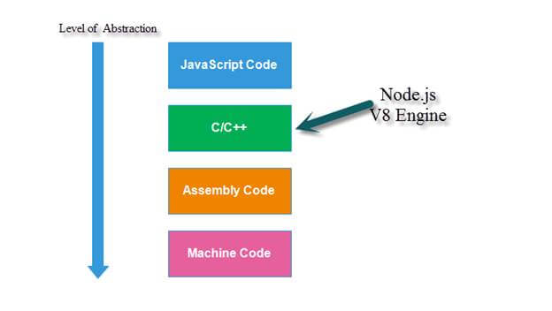

Untuk menjadi seorang Web Developer atau seorang Front End Developer, ada banyak hal yang harus Anda pelajari. Beberapa di antaranya adalah fundamental html yang dapat anda baca [disini](https://kopi.dev/html/) dan juga bahasa pemrograman JavaScript.

Pada kesempatan ini, kita akan mempelajari lebih banyak mengenai  bahasa pemrograman JavaScript.

Di halaman ini, Anda akan mendapatkan jawaban untuk pertanyaan-pertanyaan seperti **apa itu JavaScript**, apa fungsi dari JavaScript, dan pertanyaan-pertanyaan lainnya.

Sudah siap untuk memulai? Mari kita awali dengan pengertian dari JavaScript.

## Apa Itu JavaScript?

JavaScript merupakan salah satu bahasa pemrograman tingkat tinggi yang diciptakan untuk membantu Anda menciptakan sebuah halaman web yang lebih interaktif dan menarik seperti menampilkan animasi 3D, audio player, video dan lain sebagainya.


Ada beberapa cara dalam membuat program JavaScript, pertama dengan cara menulis langsung program JavaScript pada sebuah file html dengan cara membuat tag script

```
<!DOCTYPE html>
<html lang="en">
<head>
    <meta charset="UTF-8">
    <meta name="viewport" content="width=device-width, initial-scale=1.0">
    <title>Document</title>
    <script>
        // Tulis kode JavaScript disini
    </script>
</head>
<body></body>
</html>
```

atau dengan membuat file dengan ekstensi `.js` yang dihubungkan kedalam file html, kemudian file tersebut akan berjalan otomatis pada saat halaman web dimuat di browser.

```
<!DOCTYPE html>
<html lang="en">
<head>
    <meta charset="UTF-8">
    <meta name="viewport" content="width=device-width, initial-scale=1.0">
    <title>Document</title>
    <script src="lokasiProgramJavascript.js"></script>
</head>
<body></body>
</html>
```

Perlu diketahui, bahasa pemrograman JavaScript tidaklah sama dengan bahasa pemrograman Java, karena keduanya merupakan bahasa pemrograman yang sangat amat berbeda 100%.

Jika antara JavaScript dan Java merupakan bahasa pemrograman yang berbeda, mengapa mereka berdua memiliki nama yang mirip ya?

## Sejarah Terciptanya JavaScript

Ketika bahasa pemrograman JavaScript diciptakan, nama yang dipilih untuknya bukanlah JavaScript, melainkan LiveScript.

Tetapi karena Java teramat sangat populer pada waktu itu, maka nama yang digunakan untuk bahasa baru inipun kemudian diganti menjadi JavaScript dengan harapan kepopuleran Java dapat mendongkrak JavaScript.

Seiring perkembangannya, JavaScript menjelma menjadi bahasa yang merdeka sepenuhnya dan memiliki spesifikasi tersendiri yang kemudian disebut sebagai **ECMAScript**.

Sekarang, JavaScript bisa dijalankan baik di browser, server, perangkat mobile atau di perangkat lain yang dilengkapi dengan program khusus bernama **_JavaScript Engine_**.

Browser biasanya memiliki sebuah mesin (_engine)_ yang tertanam didalamnya yang disebut “_**JavaScript Virtual machine**_”. Setiap browser memiliki jenis engine yang berbeda walaupun saat ini ada beberapa browser dengan engine yang sama. Berikut contohnya:

- **Opera browser** serta **Google Chrome** memiliki mesin JavaScript yang bernama V8, awalnya Opera Browser memiliki engine sendiri bernama Carakan, namun di versi 15 opera mengubah mesin JavaScript miliknya dengan V8 Engine.
- **Firefox** dilengkapi dengan mesin JavaScript yang disebut SpiderMonkey
- **Safari browser** dalam komputer Apple biasanya hadir dengan mesin JavaScript yang disebut SquirrelFish atau Nitro
- **Microsoft Edge** memiliki mesin JavaScript dengan nama ChakraCore
- **Internet Explorer** mempunyai mesin JavaScript yang disebut dengan Chakra atau Trident, tergantung pada versi browser yang dimilikinya

### Bagaimana mesin JavaScript di atas bekerja?

Perhatikan beberapa langkah di bawah ini.

- Pertama-tama, mesin JavaScript akan membaca (_read_) dan menguraikan (_parsing_) kode JavaScript
- Kemudian skrip akan diubah oleh mesin JavaScript ke dalam bahasa mesin
- Berikutnya, kode mesin akan berjalan dengan cukup cepat.



Pada setiap langkah dalam memproses file JavaScript, mesin JavaScript (JavaScript Engine) akan melakukan optimisasi. Mesin bahkan sanggup melihat code yang sedang diubah ketika masih dijalankan.

Selain itu, mesin JavaScript juga mampu menganalisa data yang mengalir melalui engine. Selanjutnya, mesin akan mengoptimalkan kode JavaScript yang dieksekusi.

## Kemampuan JavaScript

JavaScript merupakan bahasa pemrograman yang cukup aman. Apa maksudnya? JavaScript ini tidak menyediakan akses tingkat rendah ke _Central Processing Unit_ atau ke _memori_ karena ketika diciptakan, tujuannya adalah untuk digunakan oleh browser yang tidak membutuhkan akses tingkat rendah.

Kemampuan JavaScript bergantung pada lingkungan dimana ia dijalankan. JavaScript dalam browser atau yang biasa disebut dengan _**in-browser JavaScript**_ sanggup melakukan banyak hal yang berhubungan dengan manipulasi halaman situs web, interaksi dengan pengguna, dan juga server web.

Berikut beberapa hal yang dapat dilakukan oleh JavaScript dalam browser:

- Menambahkan kode html ke halaman situs web secara langsung serta mengubah konten yang sudah ada dan memodifikasi situs web
- Memberikan reaksi terhadap tindakan yang diambil oleh pengunjung situs web, menjalankan perintah yang diberikan oleh mouse, menggerakkan pointer, serta menekan tombol
- Mengirimkan permintaan ke server jarak jauh melalui jaringan internet, mengunggah atau mengunduh file, mekanisme ini biasanya _AJAX_.
- Mendapatkan cookies dan mengatur cookies
- Mengingat atau menyimpan data yang ada di pihak user dengan menggunakan fitur penyimpanan lokal (_LocalStorage_, _IndexedDb_, dll)

Meskipun sanggup melakukan berbagai hal, _**in-browser JavaScript**_ atau JavaScript dalam browser juga dibatasi dalam beberapa hal.

## Batasan yang Diterapkan Pada In-Browser JavaScript

Demi keamanan para penggunanya, kemampuan yang dimiliki oleh in-browser JavaScript telah dibatasi. Hal ini bertujuan untuk mencegah halaman situs web yang jahat untuk mencuri informasi pribadi pengguna dan merusak data yang dimiliki oleh pengguna. Pembatasan yang diberlakukan dalam in-browser JavaScript antara lain adalah:

### Read & Write File Didalam Hard disk

JavaScript tidak diizinkan untuk membaca serta menulis file secara sembarangan di hardisk. JavaScript juga tidak boleh menyalin file serta menjalankan program. JavaScript tidak memiliki akses secara langsung ke berbagai fungsi dalam sistem operasi. Browser terbaru secara terbatas memperbolehkan JavaScript untuk melakukan tindakan dengan melibatkan file.

### Akses Mikrofon & Kamera

JavaScript memerlukan izin dari pengguna untuk mengakses mikrofon serta kamera dan perangkat lain yang terhubung dengan browser. Halaman yang mengaktifkan JavaScript tidak bisa diam-diam mengaktifkan kamera web untuk mengamati lingkungan sekitar serta menyebarkan informasi yang diperoleh dari perangkat yang tersambung dengan browser.

### Same Origin Policy

Adanya Same Origin Policy. Kebijakan tersebut memungkinkan jendela atau tab yang berbeda tidak mengenali jendela atau tab lain. Seandainya tab atau jendela mengenali tab atau jendela yang lain, JavaScript dalam satu halaman tidak akan bisa mengakses halaman lain apabila kedua JavaScript berasal dari situs yang berbeda. Hal ini mengurangi pencurian informasi antara website yang sedang dibuka.

JavaScript dapat berkomunikasi langsung dengan server menggunakan koneksi internet. Namun, kemampuan JavaScript dalam menerima data dari situs web yang lain menjadi tidak berfungsi. Batasan tersebut tidak berlaku jika JavaScript dijalankan di luar browser, seperti di server.

## Kehebatan JavaScript

Ada beberapa kehebatan JavaScript yang membuatnya menjadi lebih unik dari pada yang lain. Apa saja kah itu? Berikut diantaranya:

- Integrasi penuh dengan CSS atau HTML
- Hal-hal sederhana yang bisa dilakukan dengan sederhana pula
- Didukung oleh seluruh browser utama serta diaktifkan secara default

Dibandingkan dengan teknologi browser lain, JavaScript adalah satu-satunya yang menggabungkan ketiga hal di atas dan disinilah letak keunikan JavaScript.

Tidak heran JavaScript menjadi alat yang sangat disukai serta paling banyak digunakan oleh para pengembang dalam menciptakan antarmuka baik browser interface maupun mobile interface.

## Bahasa Pemrograman Diatas JavaScript

Setiap orang memiliki kebutuhan yang berbeda terhadap bahasa pemrograman, begitu juga JavaSript. Kebutuhan ini biasanya didasari oleh pengalaman pada penggunaan bahasa pemrograman sebelumnya selain JavaScript.

Sehingga bahasa pemrograman baru banyak bermunculan, dimana bahasa pemrograman baru ini yang ditranspilasi atau diubah ke dalam JavaScript sebelum dijalankan pada browser.

Contoh bahasa bahasa-bahasa pemrograman yang berjalan diatas JavaScript seperti:

- _CoffeeScript_ yang memperkenalkan sintaks yang lebih pendek dan memperbolehkan anda untuk menulis kode yang lebih tepat dan lebih jelas
- _TypeScript_ yang berfokus pada penambahan tipe  data yang ketat (_strict data typing_) guna menyederhanakan dukungan serta pengembangan sistem yang kompleks
- Flow merupakan fitur untuk menambahkan tipe data seperti TypeScript, tetapi menggunakan sebuah cara yang berbeda
- Brython adalah transpiler Phyton ke JavaScript yang mengizinkan Anda untuk menulis aplikasi menggunakan Python murni tanpa menggunakan JavaScript.

Anda telah mendapatkan detail lengkap mengenai **apa itu JavaScript** dan kelebihan serta batasan yang dimilikinya. Tidakkah Anda tertarik untuk membuat situs web dan aplikasi seluler yang lebih hidup menggunakan JavaScript?
