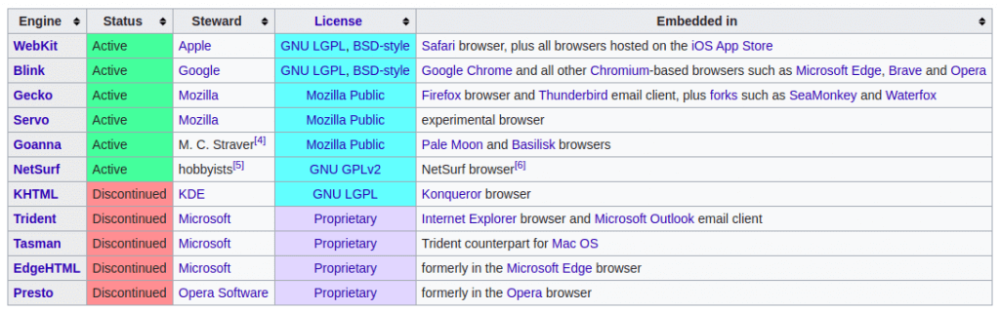
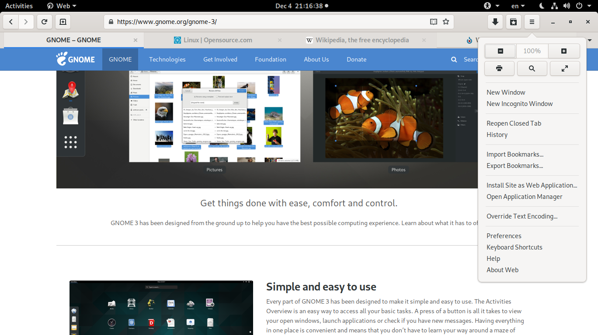

Menurut statistik yang diambil dari [https://gs.statcounter.com/browser-market-share](https://gs.statcounter.com/browser-market-share), [browser](https://kopi.dev/tag/browser/) safari setidaknya memiliki 15% pengguna dari seluruh total pengguna internet. Angka 15% cukuplah besar, oleh karenanya kita perlu peduli melakukan testing website kita di safari agar kita memiliki gambaran bagaimana experience website kita di pengguna _browser_ safari.

## Apakah melakukan testing di Chrome Browser sudah cukup?

Tidak bro, kalau cuman di test di browser Chrome sangat tidak cukup. Kenapa perlu di test di browser safari? Selain jawabannya ada di paragraf diatas, yang harus kita ketahui adalah browser safari dan browser Chrome menggunakan Engine yang berbeda dalam merender sebuah web. Kira-kira seperti ini daftarnya:

[https://en.wikipedia.org/wiki/Comparison_of_browser_engines](https://en.wikipedia.org/wiki/Comparison_of_browser_engines)

## Bagaimana cara instalasi Safari Browser di Linux?

Jadi yang perlu kita perhatikan adalah pada engine yang digunakan, karena safari menggunakan Webkit engine, dan safari tidak dapat di install di Linux, cara paling mudah yang dapat kita lakukan adalah menginstal browser yang menggunakan [Webkit engine di Linux](https://kopi.dev/tag/webkit/). Dan browser yang dapat di install bernama browser **Gnome Web**

### Browser Gnome Web

Browser Gnome Web pada mulanya disebut dengan browser Epiphany hingga 2012. Gnome web sendiri adalah browser web gratis dan open-source berbasis **[WebKitGTK](https://kopi.dev/tag/webkit/)**, yang dikembangkan oleh GNOME, dan ini adalah default browser untuk **GNOME**.

Gnome web browser

Cara installnya gampang banget, kalian tinggal menuju ke [https://snapcraft.io/epiphany](https://snapcraft.io/epiphany) disana ada tombol installnya kok. ?

Segini dulu artikel dari saya, dan jika artikel ini dirasa membantu kalian, share ya,atau jika ada yang perlu saya koreksi, saya dengan senang hati menerima masukan. Terimakasih.
