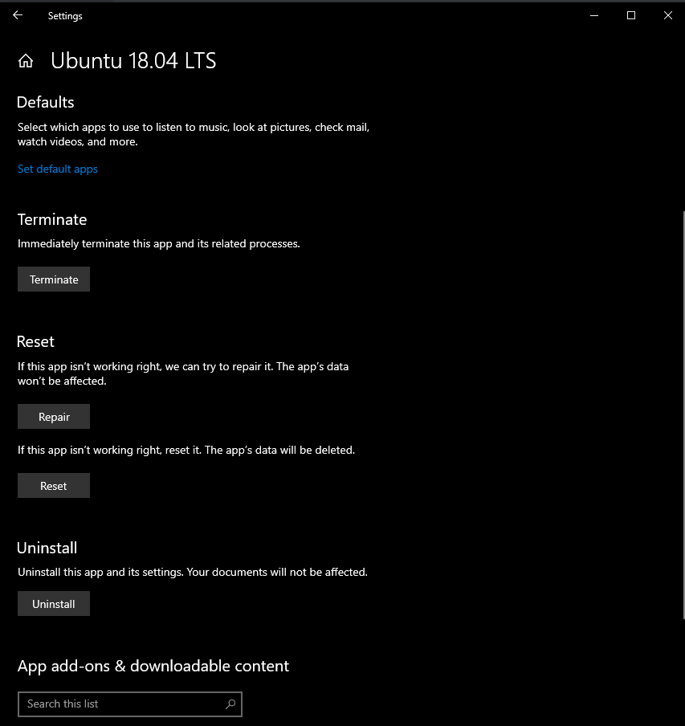

import GoogleAds from "~/components/Ads.astro";

Saat instalalasi [WSL](/a-comprehensive-guide-to-enabling-windows-subsystem-for-linux-wsl) 2 kadang terjadi error, error yang muncul biasanya seperti ini:

<GoogleAds />

```
C:\>ubuntu
Installing, this may take a few minutes...
Installation Failed!
Error: 0x8007019e
Press any key to continue...
```

## Windows Subsystem For Linux

Untuk mengatasi ini caranya sangat mudah, Anda hanya perlu memastikan opsi "[Windows Subsystem For Linux](/a-comprehensive-guide-to-enabling-windows-subsystem-for-linux-wsl)" sudah dicentang


Apabila sudah dicentang, silahkan lakukan restart.

## Reset Linux Distribution pada WSL 2

<GoogleAds />

Setelah selesai melakukan restart, pastikan untuk melakukan reset linux distribution pada windows 10, caranya pada menu start kita cari linux distribution yang ingin kita gunakan, setelah itu klik kanan, dan klik setting.

Pada menu setting, kalian tekan tombol reset.


