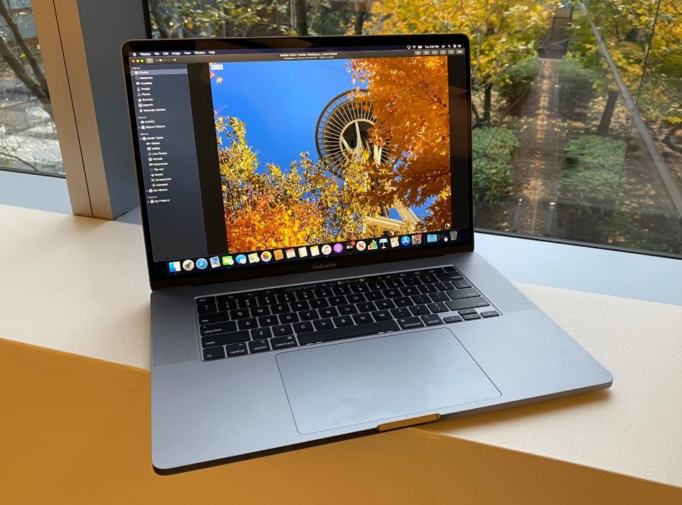
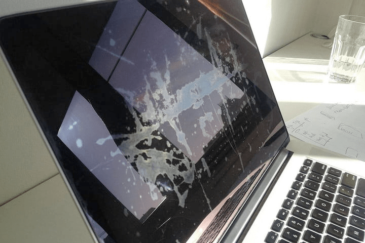
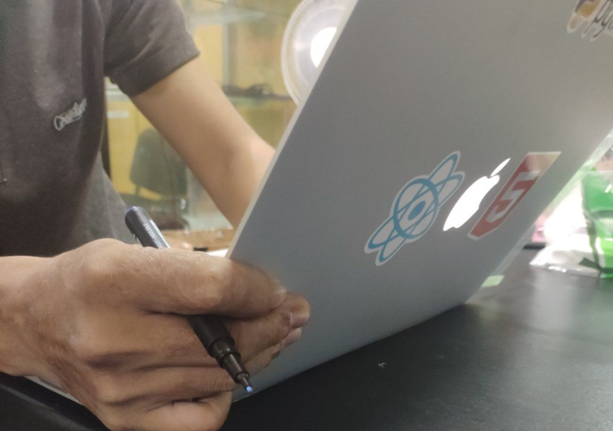
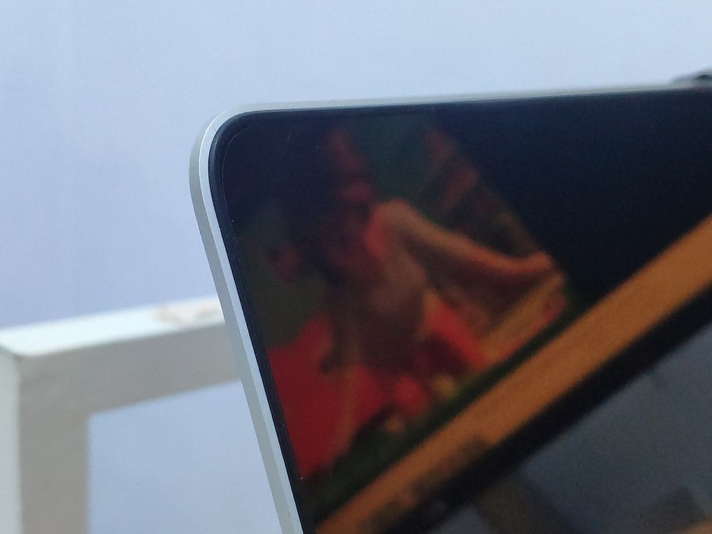
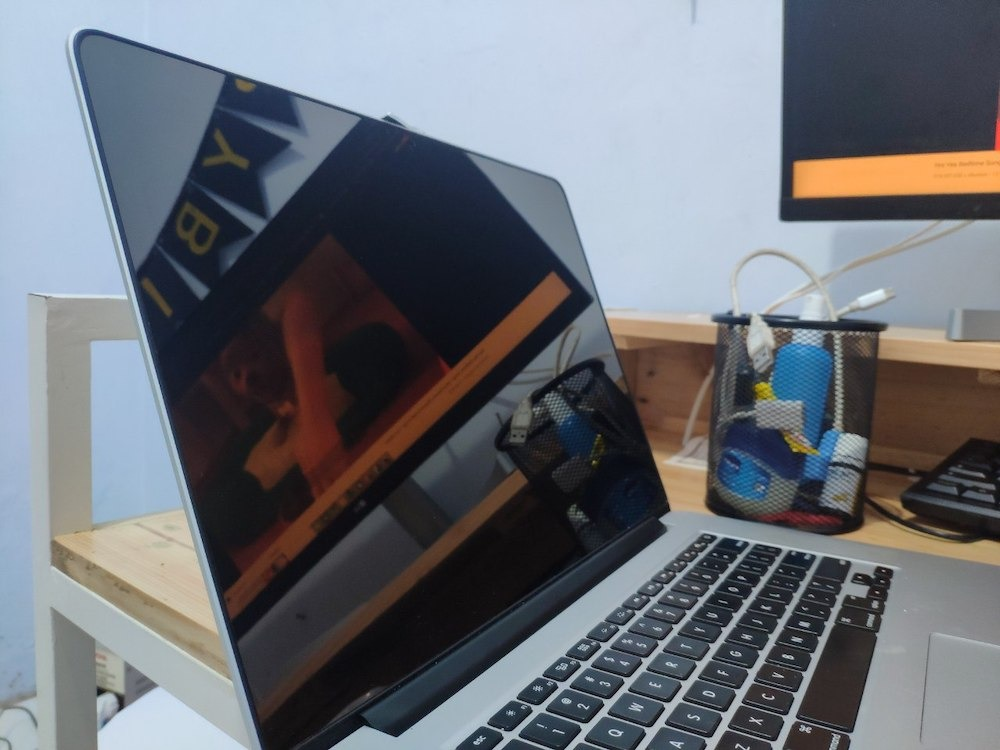

import GoogleAds from "~/components/Ads/horizontal.astro";

Macbook merupakan salah satu device yang banyak dimiliki oleh seorang _software developer_, _designer_, dll. Menurut saya pribadi, Macbook adalah perangkat komputer yang memberikan _experience_ sangat baik dari segi performa, touchpad, layar retina, dan masih banyak hal lainnya yang mungkin juga dirasakan oleh para **Apple Fanboy**.

<GoogleAds />

Bagi saya pribadi, kekurangan Macbook terletak pada harga yang ditawarkan. Untuk mendapatkan sebuah Macbook dengan layar _Retina Display_ kita setidaknya harus mengeluarkan budget minimal 12juta rupiah. Untuk tipe terbaru Macbook Pro 16inch _Retina Display_ di bandrol dengan harga paling murah 35juta rupiah. Harga yang menurut saya sangat fantastis alias mahal bagi saya yang memiliki pendapatan biasa-biasa saja ? .

Dibalik harganya yang mahal, layar _retina display_ yang ciamik ini tidak lepas dari sebuah permasalahan yang cukup menjengkelkan. Masalah ini sebenarnya sudah muncul lama sekali, namun Apple belum juga memberikan solusi atau bahkan pengumuman yang kongkrit untuk masalah ini. Masalah tersebut terletak pada layarnya yang kerap mengalami staingate.

## Apa itu Staingate?

Staingate adalah masalah yang terjadi pada layar retina di Macbook, permasalahan ini terletak pada _coating_ layar yang sedikit demi sedikit terkikis, masalah ini muncul karena layar yang bersentuuhan dengan _keyboard_, atau muncul saat dilakukan pembersihkan layar dengan cara yang kurang tepat. Hal ini menyebabkan layar sangat tidak nyaman dilihat dan sangat mengganggu, apalagi bagi seorang desainer, ye kan? ? .

<GoogleAds />

Jika teman-teman membuka google untuk mencari cara menghilangkan staingate, teman-teman akan menemukan beberapa cara untuk menghilangkannya, salah satunya dengan listerine mouth wash yang belum pernah saya coba tentunya. Saya sendiri pernah mengalami staingate, namun tidak begitu parah, hanya sekedar bercak tombol keyboard yang ada di layar Macbook, dan itu sangat mengganggu dan tidak dapat dihilangkan.

## Bagaimana mencegah staingate pada Macbook ?

<GoogleAds />

Pepatah diatas sering kali kita dengar, dan menurut saya, petatah ini juga berlaku pada kasus ini. Apabila Macbook yang kita miliki tidak mendapatkan fasilitas replacement layar secara gratis, kita setidaknya harus mengeluarkan budget minimal 6-7jt (Macbook Pro 2016) untuk mengganti layar retina, mahal banget kan? ?

Sebelum permasalahan itu terjadi dan saya harus keluar uang yang cukup banyak, saya inisiatif melindungi layar Macbook dengan cara paling murah, yaitu dengan memasang screen guard dengan harga kisara 50-100ribu saja.

## Apa itu MDSB Skin Protector?

Sebenarnya di toko online sangat banyak pilihan _screen protector_, namun berdasar pada pengalaman, saya sering gagal saat melakukan pemasangan _screen protector_. So... daripada habis uang namun hasil kurang bagus, saya percayakan kepada seseorang yang udah jago dalam memasang _screen protector_, ini adalah foto saat proses pemasangan:

Akhirnya saya percayakan lagi ke **MDSB Skin Protector** di Hi-tech Mall Surabaya, ini kedua kalinya saya memasang screen protector untuk Macbook, pertama pada awal tahun 2017 lalu, dan yang kedua minggu kemarin.

Alasan saya mempercayakan ke **MDSB Skin Protector** tidak lain karena mereka cukup profesional dalam menangani screen protector, hasilnya sangat rapih, pokoknya bagus banget, dan ada pilihan dof maupun glossy. Ini adalah hasilnya:

Ada 2 pilihan _screen protector_, ada yang glossy dan dof, kebetulan saya pakai glossy, karena stocknya lagi nggak ada untuk tipe 15inch. ? Jadi sekian tulisan saya tentang staingate. Terimakasih teman-teman
