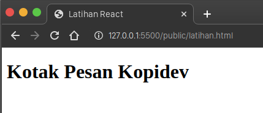
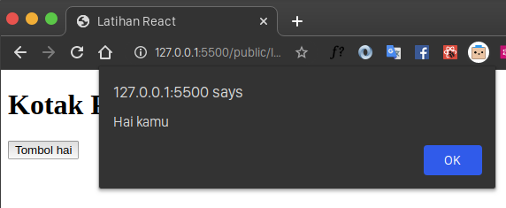
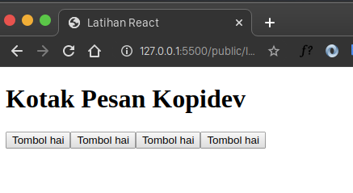
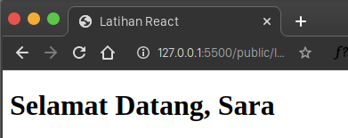

Pada artikel kali ini kita akan belajar sebuah [tutorial dasar reactjs](https://www.google.com/search?q=reactjs+tutorial) dengan cara yang paling sederhana dan mudah untuk dipahami, jika kalian belum membaca artikel tentang reactjs sebelumnya, saya sarankan untuk membacanya.

> Baca Juga : [Pemahaman dasar reactjs untuk pemula](https://kopi.dev/reactjs-tutorial-dasar/)

Pada tutorial dasar reactjs kali ini kita akan membuat sebuah aplikasi "Message Box" atau Kotak Pesan, aplikasi kotak pesan adalah aplikasi sederhana untuk menampilkan alert  saat sebuah tombol di klik.

Aplikasinya sangat sederhana, lingkup yang akan kita buat seputar membuat button dan menampilkan alert yang dikirim dari sebuah tombol.

## Pemahaman Dasar

Ada beberapa cara untuk memulai menggunakan reactjs, dari yang paling mudah hingga yang tidak cukup mudah, karena membutuhkan beberapa instalasi yang cukup memakan waktu.

Oleh karena itu, pada tutorial dasar reactjs kali ini kita akan memulai reactjs dengan cara yang paling mudah.

Cara yang paling mudah untuk memulai reactjs adalah dengan menggunakan file HTML biasa, lalu kita import _React_, _ReactDOM_, serta _Babel library_ kedalam file HTML yang kita gunakan. Tahapan yang perlu kita lakukan untuk memulai adalah:

1. Buat file **index.html** - Sebagai file untuk menampilkan reactjs library
2. Import **react library** - library yang diperlukan untuk memulai reactjs
3. Import **react dom library** - library yang diperlukan untuk memulai reactjs
4. Import **babel** - library yang diperlukan untuk melakukan kompilasi sintaks \`**jsx**\` pada JavaScript

### Apa itu JSX?

**JSX** adalah singkatan dari JavaScript XML. JSX memungkin kita untuk menulis tag HTML didalam JavaScript. Berikut adalah contohnya:

```
ReactDOM.render(
  <h1>Welcome Selamat Datang di Reactjs Kopidev !!</h1>,
  document.getElementById('container')
);
```

Kode **JSX** mirip seperti kode yang ada pada **HTML**, karena kita dapat menulis semua elemen yang ada pada **HTML** kedalam **JSX**.

Apabila sintaks diatas kita diajalankan di browser, maka sintaks diatas akan menampilkan pesan di dalam tag `h1` , lalu tag `h1` tersebut akan disematkan kedalam elemen  `container`.

`JSX` juga digunakan oleh pengguna reactjs karena mempermudah dan mempercepat dalam pembuatan sebuah UI komponen dibanding kode JavaScript biasa.

### Apakah kita harus & perlu menggunakan JSX?

Jawabannya adalah tidak, karena itu preferensi masing-masing software engineer, namun perlu kita ketahui, tujuan dari dibuatnya `JSX` adalah untuk mempermudah dalam development reactjs.

Sebab, jika kita tidak menggunakan `JSX` dalam membuat aplikasi reactjs, kita akan sedikit kesulitan, karena kita harus menuliskannya seperti ini:

```
"use strict";

React.createElement(
  "p",
  null,
  "Welcome Selamat Datang di Reactjs Kopidev !!"
)
```

Menurut kalian lebih nyaman yang mana antara JSX dan tidak menggunakan JSX? Bagi saya pribadi lebih nyaman menggunakan JSX dan saya memilih menggunakan JSX.

### Apa itu Babel?

Babel adalah sebuah Javascript compiler. Babel digunakan untuk mengkonversi ECMAScript 2015+ agar kompatibel dengan browser yang belum mendukung ECMAScript 2015+.

Pada kasus JSX yang kita tulis diatas, jika kita tidak menambahkan babel, browser tidak akan dapat menjalankan atau mengerti kode yang kita tulis, sehingga layar browser tidak akan menampilkan apapun karena menganggap script yang kita tulis tidak dikenali. Oleh karena jika kita menggunakan JSX, kita membutuhkan babel.

Ini adalah hasil kompilasi yang dilakukan oleh babel, terhadap sintaks JSX yang kita tulis:

```
// JSX SEBELUM dicompile
ReactDOM.render(
  <h1>Welcome Selamat Datang di Reactjs Kopidev !!</h1>,
  document.getElementById('container')
);

// JSX SESUDAH dicompile oleh babel
"use strict";
ReactDOM.render( /*#__PURE__*/React.createElement("h1", null, "Welcome Selamat Datang di Reactjs Kopidev !!"), document.getElementById('container'));
```

## Membuat aplikasi sederhana dengan reactjs

Buka code editor, lalu buat sebuah file bernama `index.html`, pada file ini, kalian import 3 file yang dibutuhkan (seperti yang diterangkan diatas), seperti ini:

```
<!DOCTYPE html>
<html lang="en">
  <head>
    <meta charset="UTF-8" />
    <meta name="viewport" content="width=device-width, initial-scale=1.0" />
    <title>Latihan React</title>
    <script src="https://unpkg.com/react@16/umd/react.development.js"></script>
    <script src="https://unpkg.com/react-dom@16/umd/react-dom.development.js"></script>
    <script src="https://unpkg.com/babel-standalone@6.15.0/babel.min.js"></script>
  </head>
  <body>
    <!-- tag yang digunakan untuk menampilkan reactjs yang dibuat -->
    <div id="root"></div>

    <!-- tag yang digunakan untuk menulis code reactjs -->
    <script type="text/babel">
      /**
       * Seluruh code reactjs akan ditulis disini
       * /
    </script>
  </body>
</html>
```

Coba kita perhatikan script `HTML` diatas, saya menambahkan tag `div` dengan id `root`, tujuan elemen ini dibuat adalah sebagai elemen utama untuk menampung atau merender script Reactjs yang akan kita buat nantinya.

Dan juga ada tag `<script tyle="text/babel">` tag ini digunakan untuk menampung seluruh file reactjs yang akan kita tulis.

### Menambahkan Judul Aplikasi

Selanjutnya kita buat sebuah elemen untuk menampilkan judul aplikasi, seperti ini:

```
    <script type="text/babel">
      function MessageBox() {
        return (
          <div>
            <h1>Kotak Pesan Kopidev</h1>
          </div>
        );
      }

      ReactDOM.render(<MessageBox />, document.getElementById("root"));
    </script>
```

Penjelasan kode diatas adalah:

1. Kita buat sebuah fungsi bernama `MessageBox()`, dalam reactjs fungsi ini disebut dengan komponen. Komponen `MessageBox` ini berisi tag `div`, yang didalamnya terdapat tag `h1` dengan isi "Kotak Pesan Kopidev"
2. Terdapat sebuah sintaks `ReactDOM.render(<MessageBox/>, document.getElementById("root"));` , sintaks ini bermaksud untuk menampilkan komponen `<MessageBox`/> kedalam tag `div` dengan id `root`

Jika kita run di browser, akan muncul seperti ini



### Menambahkan tombol

selanjutkan kita buat sebuah tombol, tombol yang akan kita buat memiliki fungsi untuk menampilkan sebuah alert saat di klik. Seperti ini:

```
function MessageBox() {
  return (
    <div>
      <h1>Kotak Pesan Kopidev</h1>
      <button
        onClick={() => {
          alert("Hai kamu");
        }}
      >
        Tombol Hai
      </button>
    </div>
  );
}
```

Jika kita run di browser, maka akan muncul seperti ini:



### Reusable Component

Seperti yang telah saya jelaskan di artikel [dasar reactjs](https://kopi.dev/apa-itu-reactjs-belajar-reactjs/) , reactjs menerapkan konsep **Reusable Component** , dimana komponen yang buat dapat digunakan secara berulang.

Di tahap ini, kita akan membuat sebuah tombol yang dapat digunakan berulang kali. Tombol ini kita beri nama "MyButton", seperti ini :

```
function MyButton() {
  return (
    <button
      onClick={() => {
        alert("Hai kamu");
      }}
    >
      Tombol hai
    </button>
  );
}

function MessageBox() {
  return (
    <div>
      <h1>Kotak Pesan Kopidev</h1>
      <MyButton />
    </div>
  );
}
```

Penjelasan sintaks diatas adalah setelah kita membuat atau memindahkan tombol yang sebelumnya kedalam komponen `MyButton`, pada komponen `MessageBox` kita ubah tombol sebelumnya menjadi `<MyButton/>`. Kita juga dapat menggunakan komponen `<MyButton/>` secara berulang, seperti ini:

```
function MessageBox() {
  return (
    <div>
      <h1>Kotak Pesan Kopidev</h1>
      <MyButton />
      <MyButton />
      <MyButton />
      <MyButton />
    </div>
  );
}
```

Hasilnya seperti ini:



### Component Props

Pada tahap ini, kita akan belajar tentang props. Pada dasarnya setiap komponen di reactjs dapat memiliki atau menerima sebuah input, attribute, dan lain sebagainya. Setiap Input terhadap suatu komponen disebut dengan props (kependekan dari property). Contoh sederhana:

```
function Welcome(props) {
  return <h1>Selamat Datang, {props.name}</h1>;
}
```

Sintaks diatas adalah untuk membuat sebuah komponen bernama Welcome, komponen welcome tersebut menerima sebuah props bernama name, jadi kita dapat memanggil komponen Welcome tersebut dengan cara seperti ini

```
const element = <Welcome name="Sara" />;
```

Hasilnya seperti ini



Pada tahap ini kita akan menambahkan beberapa props terhadap komponen MyButton, props yang akan tambahkan adalah judul, dan pesan. Kurang lebih seperti ini:

```
function MyButton(props) {
  return (
    <button
      onClick={() => {
        alert(props.pesan);
      }}
    >
      {props.judul}
    </button>
  );
}

function MessageBox() {
  return (
    <div>
      <h1>Kotak Pesan Kopidev</h1>
      <MyButton judul="Arryangga" pesan="Selamat Datang Arryangga" />
      <MyButton judul="Jokowi" pesan="halo boskuuuuhhhhh" />
      <MyButton judul="Soekarno" pesan="Gimana pak disana? Enak?" />
    </div>
  );
}
```

Hasilnya seperti ini, bisa kalian klik satu per satu

Latihan React

```html
<script
  crossorigin=""
  src="https://unpkg.com/react@16/umd/react.production.min.js"
></script>

<script
  crossorigin=""
  src="https://unpkg.com/react-dom@16/umd/react-dom.production.min.js"
></script>

<script src="https://unpkg.com/babel-standalone@6.15.0/babel.min.js"></script>

<script type="text/babel">
  function MyButton(props) { return ( <button onClick={() => { alert(props.pesan); }} > {props.judul} </button> ); } <div></div> function MessageBox() { return ( <div> <MyButton judul="Arryangga" pesan="Selamat Datang Arryangga" /> <MyButton judul="Jokowi" pesan="halo boskuuuuhhhhh" /> <MyButton judul="Soekarno" pesan="Gimana pak disana? Enak?" /> </div> ); } <div></div> ReactDOM.render(<MessageBox />, document.getElementById("root"));
</script>
```

##

Kesimpulan

Tutorial ini bertujuan untuk memahami konsep dasar reactjs, dengan cara belajar memahami apa itu JSX, apa itu babel, dan apa korelasi antara babel dan JSX. Dan juga kita belajar membuat sebuah aplikasi sederhana yang didalamnya terdapat reusable komponen, dan juga props pada reactjs.

Sampai jumpa di tutorial berikutnya ya. Terimakasih banyak
