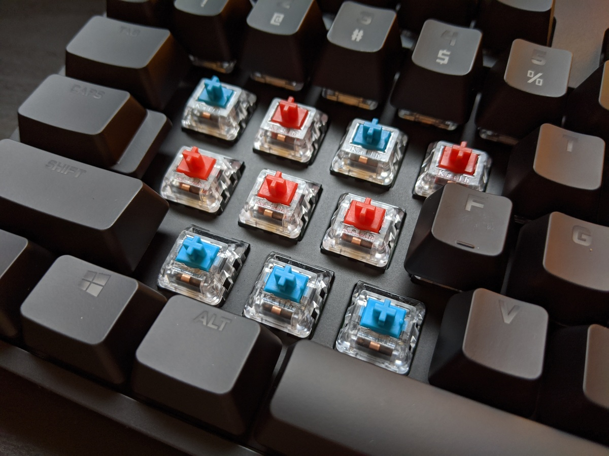

import GoogleAds from "~/components/Ads/horizontal.astro";

**Logitech**, siapa yang tak kenal merek ini. Merek ini sudah terkenal sejak saya menggunakan PC pertama saya di sekitar tahun 90' an. Merek ini terkenal akan kehandalan nya dalam memproduksi perangkat pendukung PC seperti mouse, keyboard, Web Cam, dan lain sebagainya.

<GoogleAds />

Bahkan mereka juga mempunyai penamaan khusus untuk perangkat gaming yaitu G Series. Dimana mereka juga memproduksi perangkat seperti _game pad_, _driving gear_, _audio_, dan lain sebagainya.

Intinya merek **Logitech** ini sudah lama terkenal untuk memproduksi perangkat mainstream untuk _Personal Computer_ baik untuk kebutuhan office maupun gaming.

<GoogleAds />

Produk Logitech yang akan kita bahas saat ini adalah keyboard mechanical gaming terbaru mereka yaitu _Logitech G Pro X Keyboard_.

Produk ini memakai format TKL atau Ten KeyLess. Jadi anda tidak akan menemukan numpad pada seri ini, keyboard ini sangat cocok digunakan untuk kebutuhan gaming maupun untuk kebutuhan di kantor.

<GoogleAds />

Produk ini dirilis sekitar setengah tahun yang lalu. Versi ini adalah versi refresh dari G Pro Keyboard mereka. Dimana mereka mengganti versi switch romer G mereka dengan model baru yaitu GX Series, yang lebih umum digunakan dan mirip dengan stem pada Cherry series.

## Fitur Keyboard Logitech G Pro X:

### RGB lighting

RGB lighting dengan software G Hub. Bisa diatur lighting per key, dengan banyak pilihan animasi. ini merupakan salah satu Software bawaan yang paling baik saat ini. Dapat menggabungkan beberapa perangkat Logitech G series lain nya dalam 1 software.

<GoogleAds />

### Detachable Cable

Detachable kabel yang bisa dilepas. Walaupun masih menggunakan port micro usb tetapi sudah merupakan nilai plus. dengan pin micro usb diapit 2 penyangga di kanan kiri nya.

### Hotswap Switches

Hotswappable mechanical switch. Jadi switch di keyboard ini bisa dicopot pasang dan diganti dengan tipe lain. yang saya lihat aneh nya pada keyboard bawaan nya menggunakan blue switch, dimana bagi kebanyakan orang tidak menyukai tipe switch tersebut untuk bermain game.

### Macro Function

12 fungsi makro yang bisa diset dengan software G Hub, jelas sangat membantu dalam game-game tertentu.

### GX Switches

Salah satu kelebihan lainnya adalah Keyboard Logitech G Pro X menggunakan GX Swithced, yang mana switch ini compatible dengan segala keycaps di Cherry MX

## Kelebihan Keyboard Logitech G Pro X

### Gaming Design

Design gaming yang menurut pendapat saya ok banget. Dari tampak samping yang tipis sampai bentuk font pada keycaps yang menarik. Bentuk nya futuristik dan rapi.

<GoogleAds />

### Dedicated Gaming

Adanya dedicate gaming dan lightning button yang secara default bisa mematikan tombol windows dan RGB LED. Yang bisa disetting di dalam G Hub untuk mematikan tombol lain nya yang tidak digunakan dalam bermain game.

## Kekurangan Keyboard Logitech G Pro X

1. Masih menggunakan micro usb yang mana saat ini sudah banyak produsen keyboard yang sudah beralih ke USB Type C.
2. Tidak ada nya fitur wireless. Sebenarnya ini fitur yang ditunggu para logitech fans saat logitech berniat untuk merefresh lini produk gaming ini, sayang nya hal ini belum terwujud.
3. Masih menggunakan ABS keycaps. Yang mana akan meninggalkan bekas jejak pada keycaps jika kita tidak pandai merawatnya.
4. Bottom row keycaps yang tidak standard, dimana spacebar menggunakan ukuran yang tdk sama dengan keyboard pada umum nya.
5. Stab pada keyboard ini agak goyang meskipun pada kondisi baru, terutama pada space bar.
6. Harga switch bawaan nya agak mahal sekitar 600 – 800 rb per box isi 92 switch.

## Kesimpulannya Keyboard G Pro X

Keyboard ini adalah produk yang menarik, sayang sekali logitech melewatkan beberapa hal penting yang simple yang menurut saya.

Dengan harga nya, Keycaps PBT dan USB Type C menurut saya simple (sangat mungkin) dilakukan oleh perusahaan sebesar Logitech.

Apalagi merubah bottom row menjadi lebih universal, sehingga memudahkan user untuk mengganti keycaps bawaan nya.

Ketiga hal ini menurut saya yang menjadikan produk ini kurang diminati oleh pencinta keyboard.

Tetapi bagi Logitech fans dijamin tidak akan melewatkan produk ini, karena menurut saya ini adalah keyboard gaming paling bagus yang pernah dikeluarkan oleh Logitech sampai saat ini, walaupun dengan beberapa kekurangan.

## Video Dari Youtube

https://www.youtube.com/watch?v=fJV406d6SbQ

> Tulisan ini diambil Handi Suparta, dengan izin publikasi dari yang bersangkutan.
