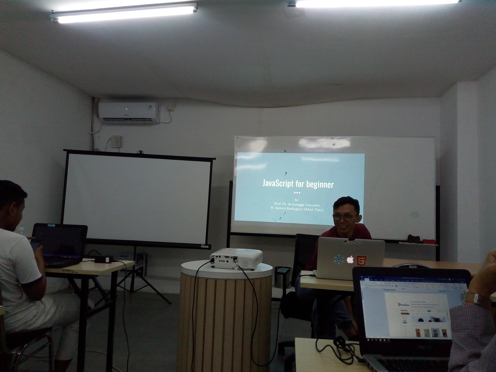
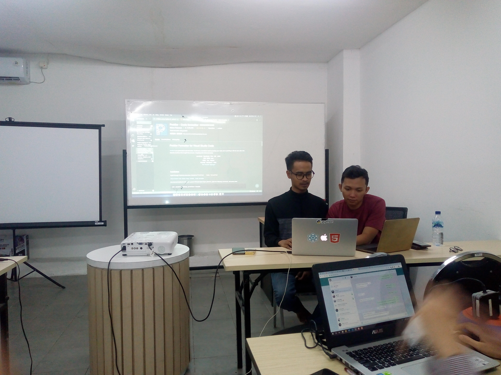
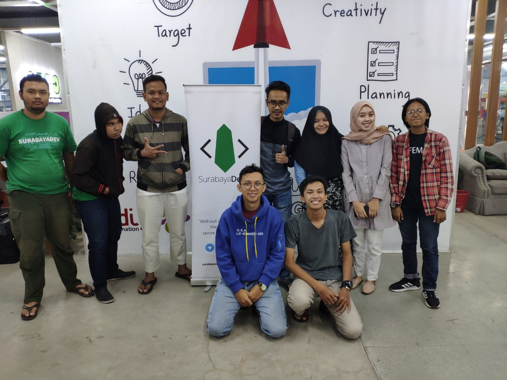

Pada hari Sabtu, tanggal 15 Februari 2020, pengurus **Komunitas Surabayadev** sejumlah kurang lebih 10 orang mengadakan kegiatan belajar bersama di **Dilo Surabaya** yang terletak di AJBS Surabaya.

Kegiatan ini merupakan kegiatan rutin yang diadakan oleh komunitas Surabayadev untuk meningkatkan skill masing-masing pengurus. Sebelumnya komunitas Surabayadev juga mengadakan [kegiatan belajar bersama dengan materi UI UX](https://kopi.dev/2021-01-belajar-ui-ux-komunitas-surabayadev/).

## Kenapa Surabayadev Belajar JavaScript?

Selama bertahun-tahun berturut-turut, JavaScript adalah bahasa pemrograman yang paling dicari dan tumbuh cepat. JavaScript merupakan salah satu pilihan paling tepat dalam pengembangan antarmuka web interaktif karena didukung oleh semua browser modern.

Seperti yang ditunjukkan oleh [survei tahunan yang diadakan oleh Stack Overflow](https://insights.stackoverflow.com/survey/2019/#technology), sekitar 70 persen dari 72.525 **Software Developer** profesional menyatakan mereka menggunakan [JavaScript](https://kopi.dev/tag/javascript/). Selain itu, ini adalah salah satu bahasa yang paling dicari yang berarti bahwa 17,8% responden belum menggunakannya tetapi ingin mempelajarinya.

Menurut data yang diberikan oleh stackshare.io, lebih dari 10400 perusahaan di seluruh dunia menggunakan JavaScript di techstack yang mereka gunakan, diantaranya adalah Facebook, Linkedin, AirBnb, dll.

Begitulah kawan, [JavaScript](https://kopi.dev/tag/javascript/) itu keren, dan oleh sebab itu Pengurus SurabayaDev ingin meningkatkan skill [programming](https://kopi.dev/tag/programming/) JavaScript dipandu oleh Antoni dan Arryangga.

## Inti Acara Belajar JavaScript Hari ini

Kegiatan belajar bersama kali ini berlangsung dari pukul 10.00 hinggal 17.00, cukup lama namun seru. Hal yang dipelajari oleh para pengurus Surabayadev diantaranya adalah:

1. Apa itu front end?
2. JavaScript Basic
   - Tipe Data
   - Array & Object Properties (Loop & Iteration)
   - DOM Manipulation
   - Events & Event Handling
   - LocalStorage
   - Fetch API
3. Live Practice (Coding & Deploy) TODO List App dengan Vanilla JS

Source code tersedia di Github: [https://github.com/surabayadev/todolist-vanillajs](https://github.com/surabayadev/todolist-vanillajs) _(Jangan lupa di ⭐ star juga ya ?)_

Seperti yang sebelumnya, sesi akhir dari acara ini ditutup dengan diskusi langsung, setiap individu dapat memberikan pertanyaan kepada Arryangga dan Antoni, serta review acara hari ini.

Dan setelah itu masuk kepada ritual intinya yang tidak boleh ketinggalan sama sekali, foto bareng:

