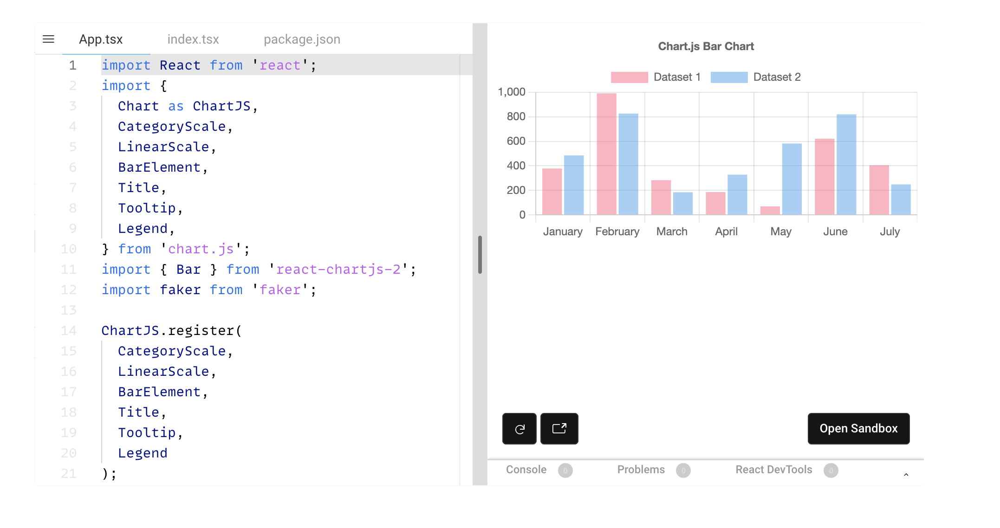
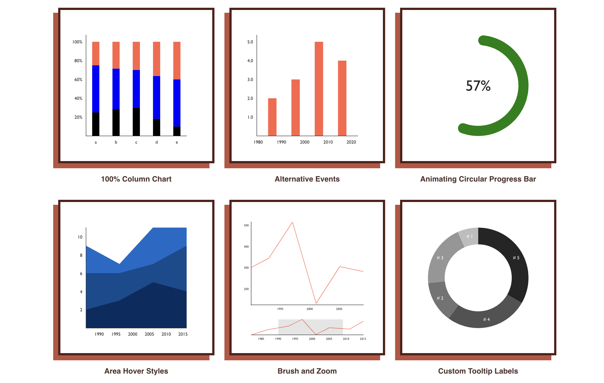
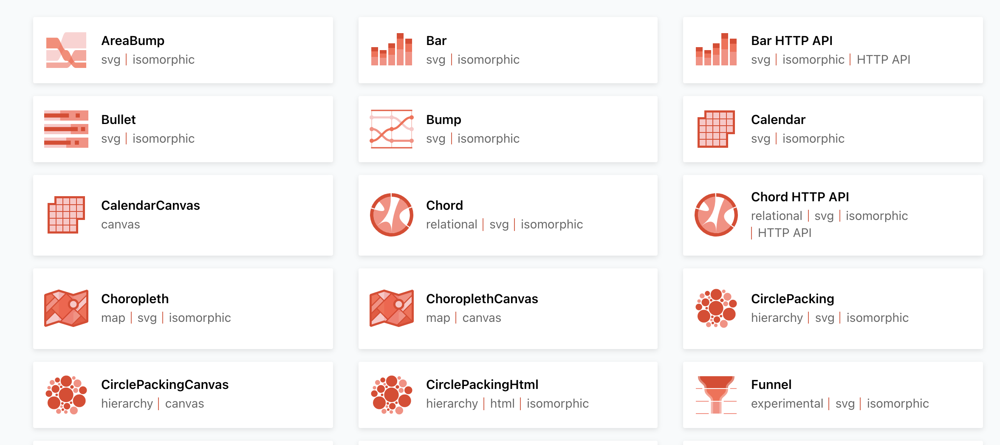
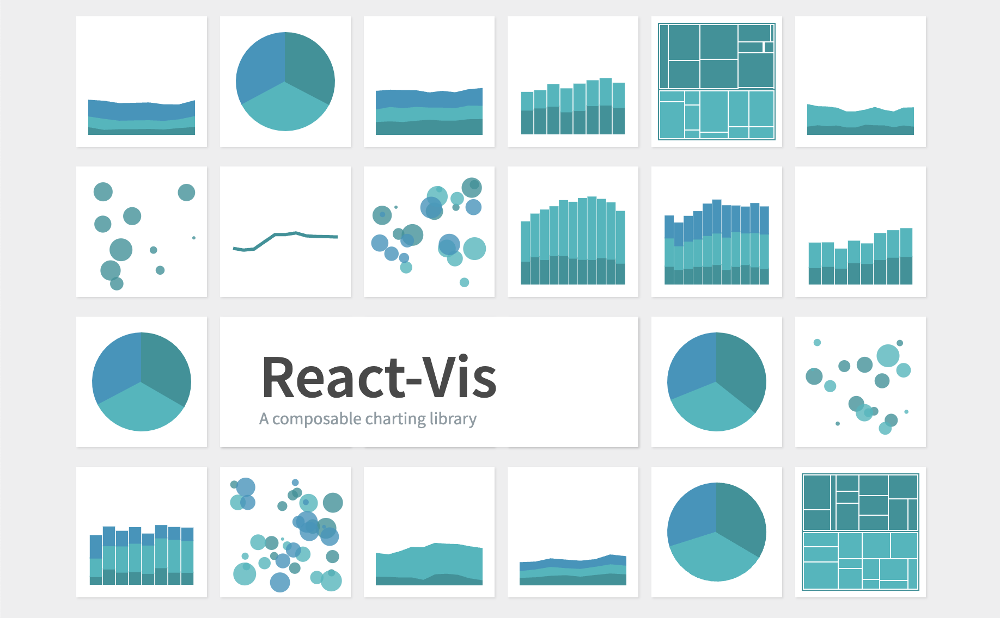

import GoogleAds from "~/components/Ads.astro";

Data or information is anywhere and is an increasing number of essential parts of our lives. We collect, send, analyze, and do masses of different matters with information or data.

Data isn't visually appealing. However, we will make it beautiful. Charts make information aesthetically alluring and less difficult to recognize and retain. In addition, people find it less difficult to interact with statistics while visuals to focus on.

There are numerous approaches to show charts to your work when constructing websites or applications. You might also additionally determine to create your charts from scratch or use any of the numerous to be had React chart libraries. This guide will evaluate the pinnacle chart libraries for React applications.

## What are the top React chart libraries?

The Charts library is designed to simplify creating charts and other data visualizations. However, simply creating a diagram from scratch is sufficient when working on a small project.

However, if you are working on a project that needs to display different data types, it may make more sense to use a chart library. Today's React ecosystem has many libraries to help you create interactive, responsive, and animated charts quickly and efficiently.

Let's compare the best React diagramming libraries without further ado and score each for features, documentation, community acceptance, and customizability.

Let's look at the five most popular and widely used React diagram libraries in no particular order.

## react-chartjs-2

If you've ever used Chart.js in React, you shouldn't have a learning curve when using this library. reactchartjs2 is a React wrapper for the popular JavaScript library Chart.js.

<GoogleAds />

Many Chart.js functions are available in reactchartjs2. reactchartjs2 only supports painting on canvas and rendering on the client-side. At the time of writing, there are over 4.3k stars on GitHub.

reactchartjs2 supports animations, and most of the charts it provides are responsive by default. In addition, the library offers some components for different chart styles by default, and you can also customize them. Unfortunately, there is no detailed documentation on reactchartjs2 itself, but the website shows the different types of charts and how to use them.

Chart.js also has detailed and easy to understand documentation. This library works well in all modern browsers and has a large user community and a great repository maintainer. You can install it with npm or yarn.

## Recharts

Recharts is a new charting library built with D3 and React, with 17,000 stars (and growing) on ​​GitHub. Recharts is one of the most popular graph libraries for React, with excellent easy-to-understand documentation and a great project maintainer.

<GoogleAds />

Recharts follows the React components principle, allowing users to create charts & diagrams with reusable React components. However, it only supports drawing for SVG, not mobile devices.

Recharts provides beautiful charts out of the box that you can customize by customizing existing component properties or adding your own. Unfortunately, charts are not responsive by default, but you can make them responsive using wrapper components.

Recharts has been around for a long time, and it has many users and a large community. You can quickly start using CDN or installing with npm or yarn.

## Victory

According to the official documentation, Victory is "a confident but fully mutable React composite ecosystem for creating interactive data visualizations." Like many other React diagram libraries on the list, Victory is built with React and D3. In addition, it comes with a variety of fully customizable charts.

<GoogleAds />

The Victory library provides robust and detailed documentation, making the library beginner-friendly and easy to use. In addition, it has (at least to some extent) paint support for SVG and customizable high-quality animations.

Victory library also provides responsive charts that work well on all screen sizes. At the time of writing, the library has over 9,000 stars on GitHub and is maintained by Formidable's developers. The main benefit of using Victory is that it can also be used to build iOS and Android apps because Victory has a version of React Native that uses almost the same API as the web version.

## Nivo

Like many other React charting libraries, Nivo is built using React and D3 and offers a variety of chart types and designs to choose from.

The library provides HTML, Canvas and SVG charts or diagrams, includes client and server rendering support, and works well with animations. In addition, it comes with a variety of beautiful graphs that you can easily customize to suit your needs.

Many of the charts it provides are responsive by default, so they work well on various screen sizes. Nivo also supports React Motion-based motion/transition.

Nivo has over 9.2K stars on GitHub at the time of writing. It boasts a thriving community and dedicated maintenance, and a beautiful website with detailed documentation to make it easy to get started. Nivo can be installed using npm or yarn.

## React-vis

Built by Uber using React and D3, ReactVis is one of the easiest React charting libraries to get started with.

If you've ever worked with React components, it's easy to work with because the components provided by react-vis work in a similar way to props, children, and callbacks.

<GoogleAds />

React-Vis can create different charts, including line, bar, and pie charts.

It provides several attractive and customizable charts out of the box and supports animated charts based on React Motion.

ReactVis also supports painting for Canvas and SVG.

ReactVis does not require deep knowledge of data visualization libraries. However, the easy to understand documentation is enough to get you started.

## Conclusion

Too many charts & diagram libraries are available for React to cover in one article. Still, the five libraries described above are some of the most widely used and loved React communities.

Recharts, reactchartjs2, Victory, Nivo, and ReactVis are widely used and proven to help React developers create informative and beautiful diagrams or charts.

When choosing which charts or diagram libraries to use in your React project, remember that they are all built to help developers achieve a specific result.

Before deciding which one is best for your project, check out the features and what it offers. For example, some diagram libraries may be ideal for smaller projects, while others are more suitable for complex projects.

Ultimately, choosing which React library to display charts depends on the needs of your project and the type of features you want to work with.

<GoogleAds />
