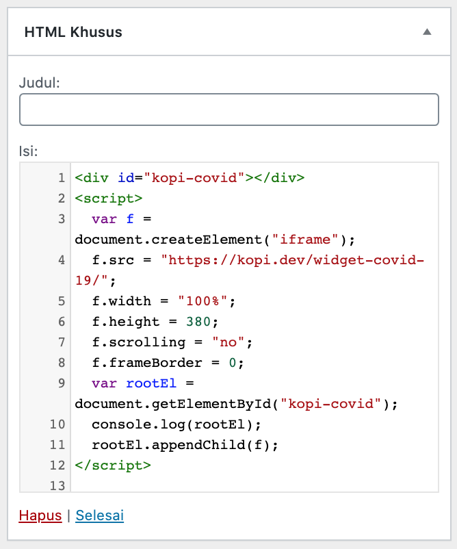
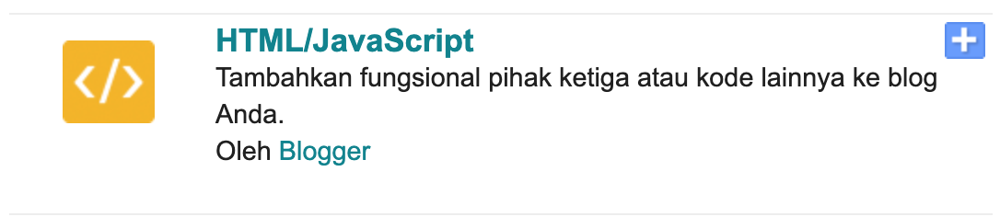
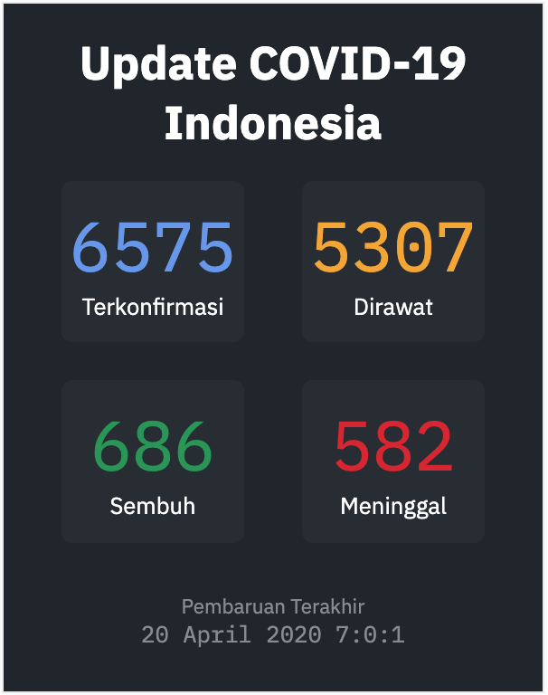

> Kepada seluruh pengguna **Widget COVID-19** disarankan agar melakukan update, dengan cara mengubah URL pada script Widget yang di sediakan. Tutorial update ada dibawah. Terima Kasih
>
> admin

Beberapa bulan lalu dunia dihebohkan oleh sebuah virus yang berasal dari Wuhan, China. Virus ini disebut dengan _Corona Virus_ dengan codename _COVID-19_.

Seiring berkembangnya waktu, virus tersebut telah menyebar keseluruh penjuru dunia, termasuk di Indonesia.

Masyarakat indonesia saling kerja sama untuk menekan pertumbuhan virus ini, dimulai dari diri sendiri tentunya, seperti seperti mengurangi kegiatan diluar, hingga menjaga kebersihkan diri setiap hari.

Sebagai seseorang yang bergelut di dalam dunia teknologi, kita mungkin ada keinginan untuk membantu masyarakat luas, seperti yang telah dilakukan oleh para dokter dan relawan yang ada di luar sana.

Jika kita seorang software engineer, dapat mencoba untuk bergabung ke [](https://kawalcorona.com/)[https://kawalcorona.com/](https://kawalcorona.com/) untuk membangun platform mereka.

Jika kita seorang _tech enthusiast_ yang kurang memiliki keahlian pemrograman, namun memiliki website atau blog, setidaknya kita dapat berkontribusi kepada masyarakat dengan memberikan informasi yang akurat dan tepat.

Dari background diatas, saya mencoba membuat sebuah widget yang dapat dipasang di website pribadi masing-masing. Widget yang saya buat dapat memberikan statistik COVID-19 yang ada di Indonesia saat ini.

Widget yang dibangun menggunakan API yang dimiliki oleh [https://kawalcorona.com/](https://kawalcorona.com/) , saya sangat berterimakasih dengan adanya API ini.

## Cara Pasang Widget Kawal Corona

Cara pemasangannya cukup simple, saya coba menjelaskan cara pemasangan di wordpress dan blogspot.

### Pasang widget kawal corona di WordPress

Untuk website yang dibangun dengan wordpress, kita dapat masuk ke halaman **Tampilan**, lalu masuk ke menu **Widget**.

Setelah itu, kita tambahkan widget **HTML Khusus** kedalam _**sidebar**_. Lalu pada kolom isi di widget **HTML Khusus** kita tambahkan script dibawah ini

```html
<div id="kopi-covid"></div>
<script>
  var f = document.createElement("iframe")
  f.src = "https://kopi.dev/widget-covid-19/"
  f.width = "100%"
  f.height = 380
  f.scrolling = "no"
  f.frameBorder = 0
  var rootEl = document.getElementById("kopi-covid")
  console.log(rootEl)
  rootEl.appendChild(f)
</script>
```

Seperti dibawah ini



### Pasang widget kawal corona di Blogger / Blogspot

Untuk memasang widget kawal corona di Blogger/Blogspot kalian dapat masuk ke halaman **Tata Letak**, lalu klik tombol **"Tambahkan Widget".** Saat muncul popup, kalian pilih menu **HTML/JavaScript** ini:



```html
<div id="kopi-covid"></div>
<script>
  var f = document.createElement("iframe")
  f.src = "https://kopi.dev/widget-covid-19/"
  f.width = "100%"
  f.height = 380
  f.scrolling = "no"
  f.frameBorder = 0
  var rootEl = document.getElementById("kopi-covid")
  console.log(rootEl)
  rootEl.appendChild(f)
</script>
```

Lalu tambahkan script diatas tadi kedalam kolom **Konten**, seperti ini:


### Pasang widget kawal corona di Laravel

Untuk pemasangan widget pada Laravel, cukup mudah sekali, kita tinggal buka `blade template` yang kita miliki, lalu kita sematkan script html diatas ke lokasi yang kita inginkan

### Mengatur ketinggian & warna widget kawal corona

Untuk mengatur ketinggian widget kawal corona, kalian dapat mengubah nilai ketinggian pada baris `f.height = 380;` , dan untuk menggunakan widget kawal corona berwarna gelap, kalian dapat mengubah url pada baris `f.src = "https://kopi.dev/widget-covid-19/";` menjadi `f.src = "https://kopi.dev/widget-covid-19/?dark=true";`

#### Mode terang widget kawal corona


#### Mode gelap widget kawal corona


