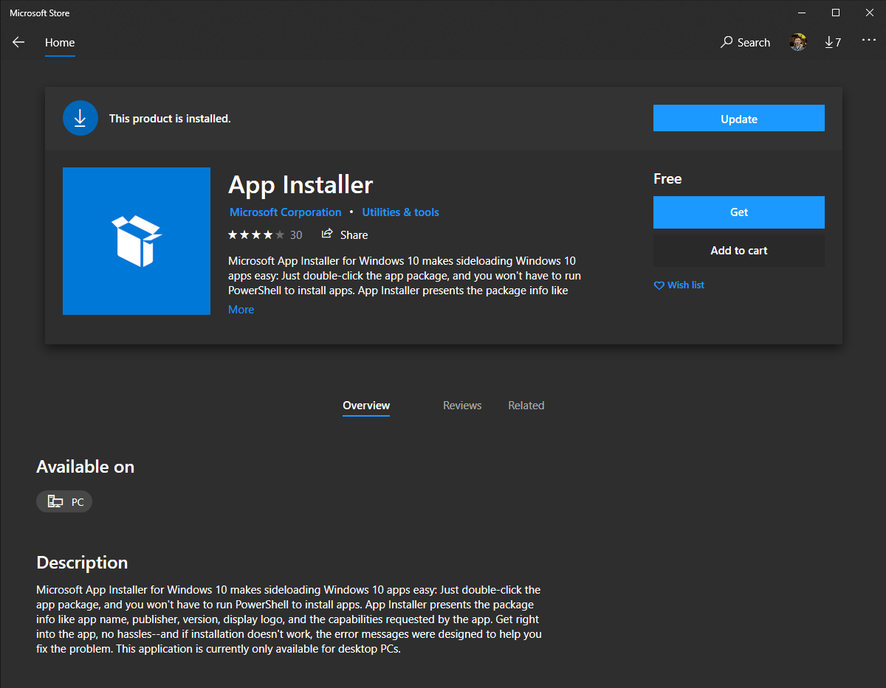
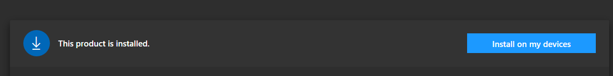
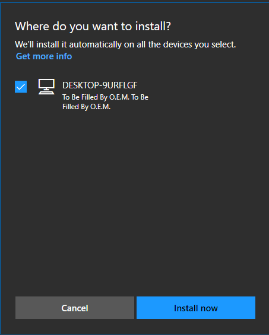
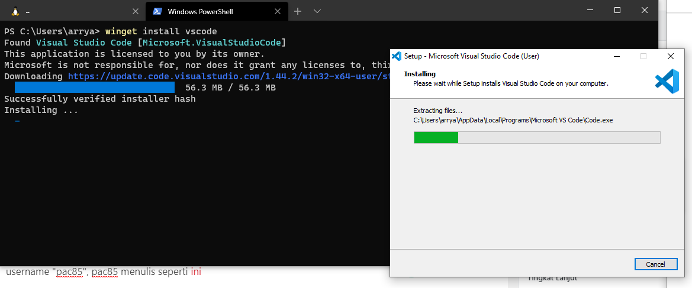
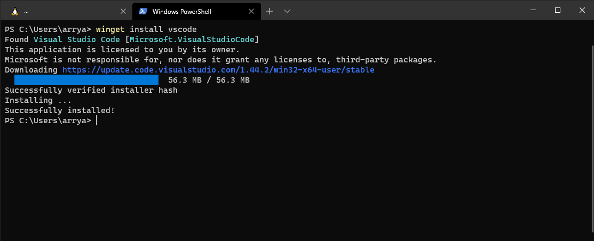

Sebagai pengguna Ubuntu, MacOS mungkin kita tidak asing lagi dengan manajer paket (package manager) spert APT, atau BREW. Apt adalah kependekan dari Advance Packaging Tools yang dimiliki oleh Ubuntu atau sistem operasi turunan Debian yang digunakan untuk melakukan installasi tools atau software.

Dengan adanya `apt` pada debian, jika kita ingin melakukan installasi software, kita hanya perlu menuliskan command seperti ini `sudo apt install nodejs` Dengan command tersebut APT atau Advance Packaging Tools akan melakukan installasi nodejs pada sistem operasi.

## Windows Package Manager

Pada tanggal 19 Mei 2020, Windows memberikan pengumuman tentang perilisan sebuah Package Manager open source yang bernama **WinGet**. WinGet sendiri adalah package manager buatan Microsoft. WinGet Package manager akan mempermudah pengguna Windows untuk melakukan installasi tools atau software pada windows.


## Installasi WinGet

Untuk dapat melakukan installasi WinGet kita memerlukan versi Windows 10 1709 (build 16299) atau yang paling terbaru. Lalu kita buka [https://www.microsoft.com/id-id/p/app-installer/9nblggh4nns1](https://www.microsoft.com/id-id/p/app-installer/9nblggh4nns1?activetab=pivot:overviewtab) lalu akan muncul seperti dibawah ini, dan kita klik tombol **Get**.



Setelah sukses terinstall, akan muncul tombol "**Install on my devices**", dan klik tombol tersebut



Setelah itu akan muncul sebuah popup, untuk memilih device yang akan di install



Lalu kita tekan tombol "**Install now**", kita tunggu beberapa saat agar installasi berhasil

### Installasi vscode menggunakan WinGet

Saya coba melakukan installasi vscode menggunakan WinGet, dengan menulis perintah `winget install vscode` , begini kira-kira prosesnya



Setelah proses installasi sukses, begini tampilan terminal



## Review WinGet menurut penulis

Setelah proses download package melalui command WinGet berhasil, WinGet akan melakukan installasi software mirip seperti installasi software secara manual, yaitu muncul popup, semisal konfirmasi lokasi folder, atau meminta persetujuan agreement jika ada, dan lain sebagainya. Dan menurut saya ini hanyalah pengganti proses download, namun dengan cara yang lebih efisien

Sisi baiknya yang sangat mempermudah adalah kita tidak perlu lagi membuka browser, mencari software yang ingin di Download, dan menunggu proses download di browser hingga selesai. Hal yang saya rasakan ternyata dirasakan juga oleh pengguna github dengan username "pac85", pac85 menulis seperti [ini](https://github.com/microsoft/winget-cli/issues/223)

> The description claims this thing to be a package manager but in reality it has nothing to do either with packages or management.  
> All it does is downloading installers (which are not packages) and executing them (which is not management).
>
> pac85 - Not a package manager

## WinGet Cache Location

Setiap software yang diinstall melalui WinGet tidak otomatis terhapus, keuntungannya adalah saat kita mencoba melakukan installasi ulang tidak akan mendownload lagi dari awal, tapi mengandalkan hasil download sebelumnya yang disimpan oleh WinGet pada folder cache, yang berada di

```bash
C:\\Users\\YOURNAME\\AppData\\Local\\Packages\\Microsoft.DesktopAppInstaller_8wekyb3d8bbwe\\AC\\INetCache
```
